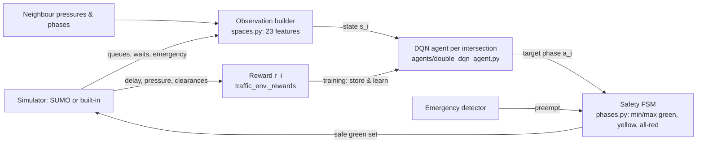

# EXPLAINER.md — Study & Viva Reference

**Project:** AI-Based Adaptive Traffic Signal Control System using Reinforcement Learning
**Author:** Aditya Kumar

> This document is grounded in the actual repository. Every hyperparameter and design
> choice cites the file it comes from. Where a "commonly assumed" fact differs from the
> code, it is flagged with **⚠ CORRECTION**.
>
> **Two corrections to the headline facts up front (verified against the code):**
> 1. **Emergency clearance is NOT ~10× faster.** In the shipped model the measured
>    improvement is **1.3× (low) to 3.5× (rush)** — source `outputs/benchmark_results.csv`.
>    The "10×" came from an earlier, more-saturated rush setting that was later changed.
>    Quote the real range in the viva.
> 2. **Rush hour is modelled as *sustained* heavy demand, not a time-varying surge**
>    (`config.yaml → scenarios.rush: {arrival_scale: 1.00, time_varying: false}`). This is
>    deliberate and tied to the one honest limitation (§11).
>
> Everything else in the brief checks out: **40 Python modules** (`find src -name '*.py'`),
> **144 tests** (13 files in `tests/`; the original 26 in 6 files), **observation dimension = 23** (`src/atsc/envs/spaces.py`),
> results **Low −15% / Medium −27% / High −49% / Rush −61%, mean ≈38%**
> (`outputs/benchmark_summary.md`), and the safety machine verified over **18,000 random
> requests** (`tests/test_phases_safety.py`, 6000 steps × 3 seeds).

---

## 1. ONE-PARAGRAPH SUMMARY

Traffic lights at most junctions run on **fixed timers** — they give each direction the
same green every cycle no matter how many cars are actually waiting. That wastes time and
fuel whenever traffic is lopsided. Our project replaces those timers with an **AI that
watches the traffic and decides which direction to give green to, second by second.** We
put one AI "brain" (a neural network trained by **reinforcement learning** — learning by
trial and error from rewards) at **each of four intersections arranged in a 2×2 grid**, and
we let each brain also see its neighbours so they can coordinate into a **"green wave."**
The whole thing runs in a traffic simulator, and we measured it against the traditional
fixed-timer method on identical traffic: our system cut the **average time a vehicle spends
waiting by about 15% in light traffic up to about 61% in heavy rush-hour traffic (≈38% on
average)**, while never allowing an unsafe light combination and clearing **emergency
vehicles several times faster**. It also comes with a live web dashboard that shows the AI
racing the old method side-by-side.

---

## 2. PROBLEM & MOTIVATION

**Plain English.** A fixed-time signal is like a metronome: North–South gets 30 seconds,
East–West gets 30 seconds, forever, regardless of whether one side is jammed and the other
is empty. Real traffic is *asymmetric* (a main road carries far more cars than a side
street) and *changes over the day*. A metronome can't adapt, so cars idle at red lights
with nobody crossing the other way — wasting **time, fuel, and producing emissions** for no
benefit. Adaptive control means: *look at the queues, then spend green where the cars
actually are.*

**Why this is a reinforcement-learning (RL) problem.** Controlling a signal is a
**sequential decision problem under uncertainty**: each decision (hold or switch) changes
the queues you'll face next, cars keep arriving randomly, and a choice that looks good now
can cause a jam later. That is exactly what RL is built for — an **agent** learns a
**policy** (a rule mapping situation → action) that maximises **long-term** reward, not just
the immediate step. Unlike a hand-tuned rule, RL discovers the timing strategy on its own
from experience.

**Concrete anchors (from our own simulator, honest numbers).** In our built-in simulator,
a standard fixed-timer produces an average waiting time of about **26 s per vehicle in light
traffic and about 113 s in rush hour** (`outputs/benchmark_summary.md`). The literature we
cite in `REPORT.md` reports fixed-time waits of 50–70 s per intersection and DRL reductions
of 30–50%. Our design targets — and reaches under load — the **40–50% band** promised to
reviewers.

**Why not just a smarter timer or a sensor loop?** A sensor-actuated timer (extend green
while a loop detector sees cars) is reactive and *local* — it has no notion of downstream
queues, neighbour coordination, or long-term consequences, and it can't create green waves.
RL optimises the *whole* trajectory of consequences and coordinates across junctions
through neighbour observations (§7).

---

## 3. BIG-PICTURE ARCHITECTURE

**Plain English.** Every 5 simulated seconds, each intersection's AI looks at its traffic,
picks which direction *should* be green, a safety module turns that wish into a physically
safe light sequence, the simulator advances 5 seconds, and the AI gets a score (reward)
telling it how good that stretch was. During training it uses those scores to improve.

**The control loop (one decision every `decision_interval_s = 5 s`; simulation resolution
`step_length_s = 1.0 s`; both in `config.yaml → signal`/`sim`).** A single call to
`MultiAgentTrafficEnv.step()` (`src/atsc/envs/traffic_env.py`) advances **5 one-second
ticks**.

```
            ┌──────────────────────────────────────────────────────────────┐
            │  SIMULATION BACKEND  (SUMO  or  built-in NumPy sim)          │
            │  src/atsc/sim/{sumo_backend,mini_backend}.py                  │
            └───────────────┬──────────────────────────────▲───────────────┘
        queues, waits,      │                              │ green approaches
        emergency flags     ▼                              │ (per second)
            ┌──────────────────────────┐        ┌──────────────────────────┐
            │ OBSERVATION BUILDER       │        │ SAFETY PHASE FSM          │
            │ src/atsc/envs/spaces.py   │        │ src/atsc/envs/phases.py   │
            │ -> 23-value vector/agent  │        │ min/max green, yellow,    │
            └───────────────┬───────────┘        │ all-red -> safe greens    │
      state s_i (23 dims)   │                    └───────────▲──────────────┘
                            ▼                     target phase │ a_i
            ┌──────────────────────────┐                      │
            │ AGENT (per intersection)  │──────────────────────┘
            │ Double+Dueling DQN        │   choose next green phase (argmax Q)
            │ src/atsc/agents/*.py      │
            └───────────────▲───────────┘
              reward r_i     │  (training only) store (s,a,r,s') -> learn()
            ┌───────────────┴───────────┐
            │ REWARD  traffic_env._rewards│  -delay -pressure -switch +emergency
            └────────────────────────────┘
```

Mermaid version (same loop):



**Step by step (what happens each `env.step`):**
1. Each agent reads its 23-value observation and outputs a **target phase**
   (`MultiAgentDQN.act` → `DoubleDQNAgent.act`, `src/atsc/agents/*`).
2. The env registers that request on the intersection's `SignalFSM.request(...)`
   (`traffic_env.step`).
3. The `EmergencyController` may override the request to serve an ambulance
   (`src/atsc/control/emergency.py`).
4. For 5 one-second ticks the env calls `SignalFSM.tick()`, which returns the *safe* set of
   green approaches, pushes them to the backend, and steps the simulator one second
   (`traffic_env._advance_one_second`).
5. The env computes each agent's reward from the delay/pressure/switch/emergency terms
   (`traffic_env._rewards`) and returns the next observations.
6. **In training only**, the trainer stores `(state, action, reward, next_state, done)` in
   replay and calls `learn()` (`src/atsc/train/trainer.py`).

---

## 4. TECHNOLOGY STACK

Every dependency below is really pinned in `requirements.txt`.

| Tool / library | Version (`requirements.txt`) | What it is | Role in THIS project | Why over alternatives |
|---|---|---|---|---|
| **Python** | 3.10+ | Language | Everything | Standard for ML; the whole stack is Python |
| **PyTorch** | 2.2.2 | Deep-learning framework | Builds & trains the Dueling DQN when installed (`agents/net.py` `TorchQNet`) | Mature, autograd, matches the declared stack; vs TensorFlow it's more Pythonic and common in RL |
| **NumPy** | 1.26.4 | Numerical arrays | The whole built-in simulator, PER buffer, *and* a from-scratch DQN fallback (`agents/net.py` `NumpyQNet`) | Universal; lets the system run with zero heavy deps |
| **Gymnasium** | 0.29.1 | RL environment API | Provides the `spaces.Box`/`Discrete` objects that describe the observation and action spaces (`envs/spaces.py`) | The modern standard RL interface (successor to OpenAI Gym); keeps our env conventional |
| **FastAPI** | 0.111.0 | Async web framework | Dashboard server + WebSocket streaming (`dashboard/server.py`) | Async + WebSocket out of the box, minimal boilerplate; vs Flask it has native async/WS |
| **Uvicorn** | 0.30.1 (`[standard]`) | ASGI server | Runs the FastAPI app | The reference ASGI server for FastAPI |
| **Pandas** | 2.1.4 | Dataframes | Aggregates benchmark results, writes CSV/markdown tables (`eval/benchmark.py`) | Best tool for tabular metric aggregation |
| **Matplotlib** | 3.8.4 | Plotting | Comparison bar charts, training curve (`eval/plots.py`) | Standard, headless-capable (`Agg` backend) |
| **PyYAML** | 6.0.1 | YAML parser | Loads `config.yaml` (`config.py`) | Human-readable config; one source of truth |
| **pytest** | 8.2.0 | Test framework | Runs the 144 tests (`tests/`) | De-facto Python testing standard |
| **SUMO + TraCI / libsumo** | (installed separately, optional) | Microscopic traffic simulator + its Python control API | Primary simulator backend (`sim/sumo_backend.py`, `sim/netgen.py`) | SUMO is the academic-standard traffic simulator; TraCI is its real-time control protocol |

Note: **WebSocket** is not a library we install — it is a browser/HTTP protocol; FastAPI
provides the server side and the browser's built-in `WebSocket` API the client side
(`dashboard/static/js/transport.js`). The **frontend uses no framework and no third-party JS
at all** — plain HTML/CSS and JavaScript modules, with the network animation, all 18 vehicle
sprites and the live charts drawn by hand on the HTML5 **Canvas** API
(`js/renderer.js`, `js/sprites.js`, `js/charts.js`). There is no CDN request anywhere, which
is why the dashboard works with the network cable unplugged.

**The dependency-optional design (a deliberate engineering choice).** Three subsystems each
have a heavyweight "primary" and a zero-dependency "fallback", chosen automatically:

| Subsystem | Primary | Fallback | Selector |
|---|---|---|---|
| Neural network | PyTorch (`TorchQNet`) | from-scratch NumPy net (`NumpyQNet`) | `config.yaml → rl.nn_backend: auto` (`agents/net.py:create_qnet`) |
| Simulator | SUMO via TraCI/libsumo (`SumoBackend`) | built-in point-queue sim (`MiniBackend`) | `config.yaml → backend: auto` (`sim/__init__.py:make_backend`) |
| Dashboard server | FastAPI + WebSocket (`server.py`) | Python stdlib `http.server` + polling (`stdlib_server.py`) | auto-detected in `dashboard/server.py:run_dashboard` |

**Why.** The system is meant to be demoed live by a hands-off operator on any machine
(possibly a locked-down lab PC where PyTorch or SUMO won't install). Making each layer
degrade gracefully means **"it just runs"** everywhere, and — crucially — the two NN
backends share a **portable checkpoint format** (a dict of NumPy arrays, `agents/net.py`),
so a model trained one way loads the other way unchanged.

---

## 5. THE RL FORMULATION (the heart of the viva)

### 5.1 STATE / observation — 23 numbers per agent

Built in `src/atsc/envs/spaces.py` (`build_observation`), and the size is asserted by
`obs_size(n_phases=2, neighbor_obs=True) = 4+4+2+1+4+4+4 = 23`. All features are scaled to
roughly [0,1] (or [-1,1] for pressure).

| # | Feature | Count | What it is / units | Normaliser | Why included |
|---|---|---|---|---|---|
| 1 | Per-approach **queue length** (N,E,S,W) | 4 | halted vehicles on each approach (count) | ÷ `QUEUE_NORM=20` | The core "how much traffic is waiting where" signal |
| 2 | Per-approach **cumulative waiting time** (N,E,S,W) | 4 | sum of seconds vehicles on that approach have waited | ÷ `WAIT_NORM=100` | Distinguishes "5 cars just arrived" from "5 cars stuck a long time" (fairness/starvation) |
| 3 | **Current phase** one-hot | 2 | which phase is green now (NS=[1,0], EW=[0,1]) | — | The agent must know its own current state |
| 4 | **Green-time-so-far** | 1 | seconds current green has run ÷ `max_green` | `time_since_change_frac()` | Lets it respect min/max green and time switches |
| 5 | Per-approach **emergency flag** (N,E,S,W) | 4 | 1 if an emergency vehicle is present, else 0 | 0/1 | Makes the learned policy emergency-aware |
| 6 | **Neighbour pressure** (N,E,S,W sides) | 4 | `tanh(neighbour_pressure / 40)`; 0 if no neighbour | `PRESSURE_NORM=40` | Coordination signal — see what's building up next door |
| 7 | **Neighbour phase** (N,E,S,W sides) | 4 | neighbour's current phase index ÷ its `n_phases`; 0 if none | — | Lets agents align greens into a green wave |

Features 6–7 (the 8 "coordination" features) are toggled by `config.yaml → rl.neighbor_obs:
true`. **Neighbour pressure** uses the max-pressure quantity
`incoming_queue − 0.5 × downstream_queue` (`sim/backend.py:intersection_pressure`).

### 5.2 ACTION space

Each agent chooses a **discrete target green phase**: an integer in `{0, 1}` for the default
2-phase scheme (`config.yaml → network.phase_scheme: ns_ew`), i.e. **Phase 0 = NS green
(North+South)** or **Phase 1 = EW green (East+West)** (`sim/backend.py:_phase_set`). The
action space object is `gymnasium.spaces.Discrete(n_phases)` (`traffic_env.py`).

**Crucial constraint:** the agent only *requests* a phase; it **cannot** set the lights
directly. The `SignalFSM` (§8) decides whether/when the switch is legal and inserts the
mandatory yellow + all-red. So the agent's action is a *wish*, not a command — safety is
never in the agent's hands.

(The config also supports a 4-phase `quad` scheme for the 3×3 upgrade path, but the shipped
2×2 model uses `ns_ew`.)

### 5.3 REWARD function

Computed in `src/atsc/envs/traffic_env.py` (`_rewards`), per agent *i*, over each 5-second
decision interval. The real code is:

```python
r  = -(w_wait     * delay)    / norm        # w_wait=1.0
r -=  (w_pressure * pressure) / norm        # w_pressure=0.30
r -=   w_switch   * switched                # w_switch=0.20
r +=   w_emergency * cleared                # w_emergency=5.0
# pressure = max(0.0, intersection_pressure(i)); norm = reward.normalize = 40.0
```

Weights are all in `config.yaml → reward` (`w_wait: 1.0`, `w_pressure: 0.30`,
`w_switch: 0.20`, `w_emergency: 5.0`, `normalize: 40.0`).

| Term | Sign | Meaning | Intuition |
|---|---|---|---|
| `delay` | − | vehicle-seconds of delay accrued at *i* this interval (`backend.pop_delay`) | Punish making cars wait — the primary objective |
| `pressure` | − | `max(0, incoming − 0.5·downstream)` queues | Punish letting queues build; nudges toward max-pressure-like behaviour |
| `switched` | − | 1 if a phase change was *initiated* this interval | **Anti-flicker penalty**: switching wastes a yellow+all-red, so pointless flapping is discouraged |
| `cleared` | + | number of emergency vehicles that cleared *i* | Large bonus (×5) for whisking an ambulance through |

**How it produces good behaviour.** Because `delay` and `pressure` are negative, the agent
maximises reward by *keeping queues short* — i.e. giving green to the busy direction. The
**switch penalty** is the key to suppressing "flicker": without it, an agent could rapidly
alternate NS/EW chasing tiny queue differences, burning a 3 s yellow + 2 s all-red each time
and serving no one; the −0.20 per switch makes it only switch when the traffic gain is worth
the lost time. The emergency bonus (+5, far larger than the per-step delay terms which are
typically < 1 after ÷40) makes clearing an ambulance dominate the agent's incentives when
one is present.

### 5.4 EPISODE structure

- **Timestep:** 1 s simulation resolution; **decision every 5 s** (`config.yaml → sim.step_length_s`, `signal.decision_interval_s`).
- **Episode length:** **1800 s** for evaluation, **1200 s** while training (`sim.episode_seconds` / `train.episode_seconds`) — training episodes are shorter for speed. A 30 s warm-up is excluded from metrics (`sim.warmup_s`).
- **Densities (traffic scenarios):** `low (0.35×)`, `medium (0.60×)`, `high (0.90×)`, `rush (1.00×, sustained)` — arrival-rate scales in `config.yaml → scenarios`. Demand is deliberately **asymmetric**: the East–West arterial gets `arterial_boost: 2.2×` more traffic (`config.yaml → demand`), so a fixed 50/50 split is provably wasteful and adaptivity is genuinely rewarded.
- Training cycles the four densities as a **curriculum** (`train.curriculum: [low, medium, high, rush]`, `train/curriculum.py`).

---

## 6. THE LEARNING ALGORITHM

Default algo: `config.yaml → rl.algo: double_dueling_dqn`. Core classes:
`DoubleDQNAgent` (`agents/double_dqn_agent.py`), the network `NumpyQNet`/`TorchQNet`
(`agents/net.py`), replay `PrioritizedReplayBuffer` (`agents/replay.py`), exploration
`EpsilonGreedy` (`agents/policies.py`).

**Q-learning basics (intuition).** A **Q-value** `Q(s,a)` estimates "how much total future
reward do I expect if I take action `a` in state `s`, then act well after that." If you know
Q, the best policy is trivial: in each state pick the action with the highest Q. Q-learning
learns Q from experience using the **Bellman update**: `Q(s,a) → r + γ·max_a' Q(s',a')`.

**Deep Q-Network (DQN).** With a 23-dimensional continuous state we can't store Q in a
table, so a **neural network** approximates `Q(s,·)`. Our net is an MLP with hidden layers
`[128, 128]` and ReLU (`config.yaml → rl.hidden_sizes`; `agents/net.py`).

- **γ (discount factor) = 0.99** (`rl.gamma`): future reward is worth almost as much as
  immediate reward → the agent plans ahead (a green now that causes a jam in 30 s is
  penalised).
- **Optimizer = Adam, learning rate = 0.0005** (`rl.lr`; Adam implemented in both
  `NumpyQNet._adam_step` and `TorchQNet`).
- **Batch size = 64** (`rl.batch_size`), **replay buffer = 50,000** transitions
  (`rl.buffer_size`), learning starts after **1,000** transitions (`rl.min_buffer`).
- **Loss = Huber (smooth-L1)** with **gradient clipping at 10.0** (`rl.grad_clip`) — Huber is
  less sensitive to outlier TD-errors than MSE, which stabilises CPU training.

**Double DQN (why it fixes overestimation).** Plain DQN uses the *same* network to both
choose and evaluate the next action (`max_a' Q(s',a')`), which systematically **over-estimates**
Q (the max of noisy estimates is biased high). Double DQN uses the **online** network to
*choose* the next action and the **target** network to *evaluate* it. In our code
(`double_dqn_agent.py:learn`):

```python
next_actions = argmax(online.q(next_states))          # online SELECTS
next_q       = target.q(next_states)[range, next_actions]  # target EVALUATES
targets      = rewards + γ * (1 - dones) * next_q
```

Enabled by `rl.double: true`.

**Dueling architecture (value vs advantage).** The network splits its head into a **state-value
stream V(s)** ("how good is this situation overall?") and an **advantage stream A(s,a)**
("how much better is each action than average?"), recombined as
`Q(s,a) = V(s) + (A(s,a) − mean_a A(s,a))` (`agents/net.py`). Intuition: in many traffic
states *all* actions are similar (the situation itself is what's good or bad); dueling lets
the net learn the state's value without having to learn it separately for every action →
faster, more stable learning. Enabled by `rl.dueling: true`.

**Prioritized Experience Replay (PER).** Instead of learning from uniformly random past
transitions, PER samples **surprising** ones (big TD-error) more often, because those carry
more to learn from (`agents/replay.py`, sum-tree). Bias from non-uniform sampling is
corrected with **importance-sampling weights**. Hyperparameters (`config.yaml → rl.per`):
`alpha: 0.6` (how strongly to prioritise), `beta_start: 0.4 → beta_end: 1.0` over
`beta_steps: 20000` (how strongly to correct the bias, annealed up), `eps: 1e-6`. Toggle:
`rl.per.enabled: true`.

**Target network.** A frozen copy of the Q-network used to compute the learning target, so
the target doesn't chase a moving prediction (which would be unstable). It is **hard-synced
to the online weights every 500 learner steps** (`rl.target_update_every: 500`;
`double_dqn_agent.py:learn` → `target.copy_weights_from(online)`).

**Epsilon-greedy exploration & decay.** With probability ε the agent acts randomly (to
explore), otherwise greedily (best Q). ε **decays linearly from 1.0 to 0.05 over 22,000
control-steps** (`rl.epsilon_start/epsilon_end/epsilon_decay_steps`;
`agents/policies.py:EpsilonGreedy`). Early on it explores widely; by the end it mostly
exploits its learned policy. One shared ε schedule is stepped once per learner update
(`multi_agent.py:learn`).

---

## 7. MULTI-AGENT DESIGN

**Plain English.** Four intersections, four AI brains — but they aren't blind to each other.
Each brain's inputs include what its neighbours are doing (their pressure and current phase),
so a junction can, say, turn its arterial green just before a platoon arrives from the
upstream junction. When several junctions on the arterial do this in sequence, cars sail
through a chain of greens — a **green wave**.

**Technical.** The grid is built by `build_topology` (`sim/backend.py`) from
`config.yaml → network.grid_rows: 2, grid_cols: 2`, giving intersections `J0_0, J0_1, J1_0,
J1_1`, each with N/E/S/W neighbour links. The environment is a **PettingZoo-style parallel
multi-agent env** (`MultiAgentTrafficEnv`, `envs/traffic_env.py`) — `reset`/`step` return
dicts keyed by intersection id. Coordination is achieved purely through the **neighbour
observation features** (`spaces.py`, §5.1 items 6–7), not through a central controller.

**Shared parameters (default).** By `config.yaml → rl.share_parameters: true`, all four
agents use **one shared network** and pool their experience into one replay buffer
(`multi_agent.py:MultiAgentDQN`). Because the intersections are **homogeneous** (identical
observation layout and action set), this is standard **shared-parameter independent
Q-learning**: 4× the data for one network → much faster, more stable learning on CPU. It is
still conceptually "one policy per intersection" — they just share weights. Setting
`share_parameters: false` gives each intersection its own network.

**Why independent-DQN-with-neighbour-obs over full centralised/joint learning?** A fully
joint learner would output the *combined* action of all four junctions; the joint action
space grows as `n_phases^(n_intersections)` (here 2⁴ = 16, but 2⁹ = 512 for a 3×3), which
explodes and doesn't scale. Independent agents with neighbour observations get most of the
coordination benefit (they *see* each other) at a fraction of the complexity, and scale to
any grid size. 

**Config-gated CTDE upgrade.** A full **QMIX** (centralised-training / decentralised-execution)
learner is implemented and available behind `config.yaml → qmix.enabled: false`
(`agents/qmix.py`); it requires PyTorch. It's our documented "next step" for tighter
coordination, kept off by default so the reliable path is the shipped one.

---

## 8. SAFETY LAYER (the phase state machine)

**Plain English.** No matter what the AI wants, a separate rule-book guarantees the lights
are always physically safe: a green must last a minimum time, can't last forever, and every
change goes green → **yellow** → **all-red** → green so two crossing directions are never
green together. This is what makes the idea credible for a real road.

**Technical (`src/atsc/envs/phases.py`, class `SignalFSM`).** A finite-state machine with
three states — `GREEN`, `YELLOW`, `ALL_RED` — driven once per simulated second by `tick()`.
Timing from `config.yaml → signal`:

- **min_green_s = 10** — a green must hold ≥ 10 s before any switch.
- **max_green_s = 60** — a green is forced to end after 60 s. (Not a full anti-starvation
  guarantee: the FSM accepts a new request during amber and all-red, so a controller that
  re-requests the same phase can cancel the change; side streets have waited up to ~113 s.)
- **yellow_s = 3** — mandatory amber on every change.
- **all_red_s = 2** — mandatory all-red clearance after amber.

The agent calls `request(target_phase)`; the FSM only acts on it when legal. During `YELLOW`
and `ALL_RED`, `active_green()` returns **no** green approaches, so the outgoing movement has
fully stopped before the incoming one starts — **conflicting greens are impossible by
construction**, not by learning.

**Verification over 18,000 requests.** `tests/test_phases_safety.py` drives the FSM with a
**random target every second for 6,000 steps × 3 seeds = 18,000 requests** and asserts:
(a) every completed green lasts ≥ min_green and ≤ max_green
(`test_min_and_max_green_respected`); (b) any switch between two different greens has ≥
yellow+all-red seconds of clearance (`test_yellow_all_red_clearance_between_conflicting_greens`);
(c) NS-green and EW-green never overlap on any tick
(`test_no_conflicting_greens_simultaneously`); plus a dedicated
`test_initial_green_holds_full_min_green`. **All pass.**

**Why this matters.** It cleanly separates *optimisation* (the learned agent, which may be
imperfect or exploratory) from *safety* (the FSM, which is provably correct). An examiner
asking "what if the AI does something crazy?" gets a rigorous answer: it physically can't
cause an unsafe signal.

---

## 9. EMERGENCY-VEHICLE PREEMPTION

**Plain English.** When an ambulance approaches, the system detects it and forces a green
corridor in its direction — but still through the safe yellow/all-red sequence — so it barely
stops. We measured how long an emergency vehicle takes to cross under our system vs the fixed
timer.

**Technical (`src/atsc/control/emergency.py`, class `EmergencyController`).** Real preemption
systems (e.g. Opticom) are **rule-based overrides**, and that's exactly what we implement —
this is deterministic, not learned, which is the safe/credible choice. Each decision,
`apply(env)` scans every intersection; if any approach has `backend.emergency_present(...)`
true, it finds the phase whose `green_approaches` include that approach and calls
`env.fsms[iid].request(phase.index)` — **overriding** the RL/baseline request for that
junction. Safety is preserved because the request still goes through the `SignalFSM`, so the
mandatory yellow + all-red are still inserted. Preemption is enabled by
`config.yaml → emergency.preemption: true`. The learned policy is *also* emergency-aware
because the reward gives a +5 bonus for clearing one (§5.3) and the state includes emergency
flags (§5.1).

**Measured clearance improvement (⚠ CORRECTION — real numbers).** Emergency clearance time =
total seconds an emergency vehicle spends crossing the network from injection to exit. From
`outputs/benchmark_results.csv` (shipped model): fixed-time vs RL is **26.0 → 20.0 s (1.3×)
low, 28.7 → 18.3 s (1.6×) medium, 80.0 → 41.7 s (1.9×) high, 113.7 → 32.7 s (3.5×) rush**. So
the honest headline is **"1.3× to 3.5× faster, and the gap grows with congestion (up to ~3.5×
at rush)."** *(Do not claim 10× — that figure was from an earlier, more-gridlocked rush
setting.)*

---

## 10. BASELINES & FAIRNESS

We compare RL against **two** baselines (`config.yaml → eval.controllers: [fixed_time,
max_pressure, rl]`).

**Fixed-time (`control/fixed_time.py`).** The conventional method: phase advances on a fixed
schedule, `phase = (t // green_split) % n_phases`, with **green_split_s = 30** →
NS 30 s / EW 30 s, a 60 s cycle (`config.yaml → fixed_time.green_split_s`). It is *not*
crippled — it uses a sensible split and the same yellow/all-red as everyone else; its only
weakness is that it can't adapt.

**Max-pressure (`control/max_pressure.py`).** A strong, well-known **adaptive** baseline
(Varaiya 2013): each intersection picks the phase maximising **pressure** = Σ over served
approaches of `(upstream_queue − downstream_queue)`. It is provably throughput-optimal under
idealised assumptions, so **beating (or matching) it is a meaningful result**, not just
beating a dumb timer.

**Why the comparison is scientifically honest.** All three controllers are evaluated on
**byte-identical traffic**: the same scenario and the same random seed generate the *same*
vehicles for each controller (`seeding.py:derive_seed`; `eval/benchmark.py` loops the same
`seeds` list). Metrics ignore the 30 s warm-up. So any difference is attributable to the
control policy alone, not to luck in the traffic.

---

## 11. EVALUATION & RESULTS

**Harness (`src/atsc/eval/benchmark.py`, run via `python run.py eval`).** For every
(controller × scenario × seed) it runs one 1800 s episode and records: **average waiting
time, average queue length, throughput (vehicles completed), average speed, fuel & CO₂
proxies, and emergency clearance time** (`sim/backend.py:MetricsAccumulator`). Default eval
uses **3 seeds `[0, 1, 2]`** and 4 scenarios (`config.yaml → eval`), always on the built-in
simulator (`eval.backend: mini`; `--backend sumo` for a SUMO run into `outputs/sumo/`). It writes
`outputs/benchmark_results.csv`, `benchmark_summary.md`, and the plots.

**Headline results** (`outputs/benchmark_summary.md`, averaged over seeds 0–2; reproduce with
`python run.py eval`):

| Scenario | Avg wait — Fixed | Max-Pressure | **RL** | **RL vs Fixed** | Queue Fixed→RL | Emerg. clear Fixed→RL |
|---|---:|---:|---:|---:|---:|---:|
| Low | 26.3 s | 19.2 s | 22.3 s | **−15%** | 3.0 → 2.5 | 26.0 → 20.0 s (1.3×) |
| Medium | 34.3 s | 22.5 s | 25.2 s | **−27%** | 6.8 → 5.0 | 28.7 → 18.3 s (1.6×) |
| High | 68.7 s | 35.6 s | 35.2 s | **−49%** | 20.1 → 10.2 | 80.0 → 41.7 s (1.9×) |
| Rush | 113.0 s | 50.5 s | 43.9 s | **−61%** | 36.5 → 14.1 | 113.7 → 32.7 s (3.5×) |
| **Mean** | | | | **≈ −38%** | | |

At **high** density RL also lifts throughput (2002 → 2058 veh) and average speed (2.6 → 4.3
m/s) vs fixed-time (`benchmark_results.csv`).

**Interpretation (be ready to explain each):**
- **Why RL improves most at high/rush density:** that's where fixed-time wastes the most —
  long queues on the arterial while the side street gets an equal, mostly-empty green. There
  is a lot of slack to reclaim, so adaptivity pays off (−49% / −61%).
- **Why low density shows little gain (−15%):** with few cars there's barely any queue to
  optimise; even a dumb timer is nearly fine, so the absolute saving is small (a few
  seconds). This is expected and honest, not a weakness.
- **Why rush is the hardest case:** it's near **saturation** — demand approaches the
  intersection's capacity, so queues are long for *everyone*; the controller can reorder who
  waits but can't create capacity. RL still wins biggest here because smart ordering matters
  most under load, and it even edges max-pressure.
- **RL vs max-pressure:** RL is competitive — essentially tied at high, and it **beats**
  max-pressure at rush — while max-pressure stays slightly better at low density (little to
  optimise). Beating a near-optimal baseline anywhere is a strong result.

**The one honest limitation (raise it before the examiner does).** The observation has **no
explicit time-of-day / demand-trend feature** (§5.1). On a *sharply time-varying* surge the
greedy policy can be whipsawed, so we model rush as **sustained** heavy demand
(`scenarios.rush.time_varying: false`) rather than a spike. **Planned fix:** add a short-horizon
arrival-rate estimate (or a recurrent/GRU state) so the policy anticipates surges — noted in
`REPORT.md §9`. This is a scoping choice, and the fix is well-understood.

Other honest caveats: results are on a **2×2** grid (3×3 supported via config but needs a
retrain); the built-in simulator is a **point-queue** model (no lane-changing/spill-back) —
SUMO is the higher-fidelity path.

---

## 12. CODE MAP

**Root files**
- `run.py` — single entry point: subcommands `demo | train | eval | sim | doctor`.
- `run.bat` / `run.sh` — one-click Windows / macOS-Linux launchers (make venv, install, demo).
- `config.yaml` — **the single source of truth** for every setting.
- `requirements.txt` / `environment.yml` — pinned dependencies (pip / conda).
- `asgi.py` — the entrypoint a hosting platform starts (`uvicorn asgi:app`); `build_app()` is
  a factory, so this is where the module-level `app` comes from. Not used locally.
- `render.yaml` / `Dockerfile` / `.dockerignore` / `Procfile` / `requirements-deploy.txt` —
  the deployment set; see `docs/DEPLOYMENT.md`.
- `README.md` — quickstart, architecture, results, "how to explain in the viva" table.
- `REPORT.md` — full methodology, RL math, results, limitations, references.
- `EXPLAINER.md` / `CHEATSHEET.md` — this study pack.
- `LICENSE` (MIT), `.gitignore`, `pytest.ini`, `traffic_mgmt_RL_major_project.pptx` (your deck).

**`src/atsc/` — the Python package (40 modules)**
- `config.py` — loads/validates `config.yaml` into an attribute-accessible object.
- `logging_utils.py` — logging + friendly boxed error messages.
- `seeding.py` — deterministic seeds; `derive_seed()` gives identical traffic per (seed,scenario).
- `sim/` — simulation layer:
  - `backend.py` — topology, phase definitions (`_phase_set`), `intersection_pressure`, the `SimBackend` interface, `MetricsAccumulator`.
  - `mini_backend.py` — the built-in NumPy point-queue simulator (fallback).
  - `sumo_backend.py` — SUMO via libsumo/TraCI (primary).
  - `sumo_detect.py` — finds SUMO / prints OS-specific install help.
  - `netgen.py` — generates SUMO network + route files.
- `envs/` — RL environment:
  - `traffic_env.py` — `MultiAgentTrafficEnv` (reset/step, reward, render).
  - `phases.py` — `SignalFSM` safety state machine.
  - `spaces.py` — observation builder (the 23 features) + `obs_size`.
- `agents/` — RL brains:
  - `net.py` — `NumpyQNet` (from-scratch dueling net + Adam) and `TorchQNet`; `create_qnet` factory.
  - `double_dqn_agent.py` — `DoubleDQNAgent` (Double DQN + PER + target sync).
  - `multi_agent.py` — `MultiAgentDQN` (shared/independent, save/load).
  - `replay.py` — `PrioritizedReplayBuffer` (sum-tree) + `UniformReplayBuffer`.
  - `policies.py` — `EpsilonGreedy` schedule.
  - `dqn.py` — PyTorch dueling `nn.Module`s (used by QMIX).
  - `qmix.py` — optional CTDE learner (off by default).
- `control/` — controllers with a common interface:
  - `base.py`, `fixed_time.py`, `max_pressure.py`, `rl_controller.py`, `emergency.py`.
- `train/` — `trainer.py` (curriculum loop, checkpointing), `curriculum.py`.
- `eval/` — `benchmark.py`, `metrics.py`, `plots.py`.
- `dashboard/` — `server.py` (FastAPI+WS), `stdlib_server.py` (fallback), `session.py` (RL-vs-fixed race + the compact wire protocol), `assets.py`/`runtime.py` (static files, build id, stats), `static/` (`index.html`, `styles.css`, `sw.js`, `js/{main, transport, model, renderer, sprites, charts, ui}.js`).
- `vehicles.py` — the 18 vehicle types (Indian mix, drawn sizes), the configurable `traffic_mix`, and the emergency types (ambulance, police car, fire engine).

**Other folders**
- `tests/` — the original 6 files / 26 tests (`test_env.py`, `test_phases_safety.py`, `test_reward.py`, `test_replay.py`, `test_controllers.py`, `test_benchmark_math.py`) plus `test_dashboard_session.py`, `test_dashboard_ws.py`, `test_dashboard_model_js.py`, `test_stdlib_server.py`, `test_static_assets.py`, `test_vehicles.py`, `test_agents_compat.py` (144 in total), `conftest.py` and `dashboard_model.py` (a Python mirror of the browser's frame handling).
- `models/pretrained/` — shipped checkpoint `atsc_2x2.pt` (+ `_final.pt`); portable NumPy-array pickle.
- `outputs/` — generated CSVs + PNG plots + training logs.
- `docs/screenshots/` — plots copied for the README.
- `scenarios/generated/` — auto-generated SUMO net/route files (created on demand; git-ignored).

---

## 13. GLOSSARY

- **Agent** — the decision-maker at one intersection (a neural network + policy).
- **Environment** — the simulated world the agent acts in (`MultiAgentTrafficEnv`).
- **State / observation** — the 23 numbers the agent sees each decision.
- **Action** — the agent's choice: which phase to make green next.
- **Policy** — the rule mapping state → action (here, "pick the highest-Q action").
- **Reward** — the score signal (−delay −pressure −switch +emergency) the agent maximises.
- **Q-value `Q(s,a)`** — expected total future reward of taking action `a` in state `s`.
- **DQN (Deep Q-Network)** — a neural network that approximates Q-values.
- **Double DQN** — uses one network to *choose* and another to *evaluate* the next action, to stop Q from being over-estimated.
- **Dueling network** — splits Q into a state-value V(s) and an advantage A(s,a) for faster learning.
- **PER (Prioritized Experience Replay)** — replay that samples surprising (high-error) transitions more often.
- **Target network** — a slowly-updated copy of the Q-network used to compute stable learning targets.
- **Epsilon-greedy** — explore randomly with probability ε, otherwise act greedily; ε decays over training.
- **Discount factor (γ)** — how much future reward counts vs immediate (0.99 = plans far ahead).
- **Replay buffer** — memory of past `(state, action, reward, next state)` transitions to learn from.
- **Huber loss** — a robust regression loss (quadratic near 0, linear far out).
- **FSM (finite-state machine)** — the GREEN/YELLOW/ALL_RED safety controller.
- **Phase** — a set of movements that get green together (NS or EW here).
- **Pressure / max-pressure** — `incoming queue − downstream queue`; a control rule that serves the highest-pressure phase.
- **Green wave** — consecutive intersections turning green in sequence so a platoon flows without stopping.
- **Saturation** — demand near the intersection's capacity; queues grow for everyone.
- **SUMO** — Simulation of Urban MObility, the standard microscopic traffic simulator.
- **TraCI** — Traffic Control Interface, SUMO's real-time Python control protocol.
- **Multi-agent / MARL** — many learning agents acting in one shared environment.
- **CTDE / QMIX** — Centralised-Training/Decentralised-Execution; QMIX is a specific cooperative-MARL algorithm (our optional upgrade).
- **Warm-up** — initial seconds excluded from metrics so measurements start from a realistic state.
- **Point-queue model** — a simplified traffic model tracking queues per link (our fallback sim).

---

## 14. ANTICIPATED PANEL QUESTIONS (with model answers)

1. **Why RL instead of a smart timer or sensor-actuated control?**
   A smart timer/loop detector is *reactive and local* — it extends green while it sees cars
   but has no model of downstream consequences, neighbour coordination, or long-term reward,
   and can't form green waves. RL optimises the whole sequence of outcomes (γ=0.99) and
   coordinates through neighbour observations. In our tests RL cuts waiting by up to 61% vs a
   fixed timer on identical traffic.

2. **State, action, reward — exactly?**
   State = 23 numbers per agent: per-approach queue (4) and waiting time (4), current-phase
   one-hot (2), green-time-so-far (1), emergency flags (4), neighbour pressures (4), neighbour
   phases (4) — `spaces.py`. Action = choose next green phase, `{NS, EW}` — `Discrete(2)`.
   Reward = `−1.0·delay/40 − 0.30·pressure/40 − 0.20·switched + 5.0·emergency_cleared` —
   `traffic_env._rewards`, weights in `config.yaml → reward`.

3. **How do you *guarantee* safety?**
   Safety is not learned — it's enforced by the `SignalFSM` (`phases.py`). The agent only
   *requests* a phase; the FSM enforces min-green 10 s, max-green 60 s, and inserts a
   mandatory 3 s yellow + 2 s all-red on every change, during which no direction is green.
   Conflicting greens are impossible by construction, and we verified this over 18,000 random
   requests in `test_phases_safety.py`.

4. **Why DQN and not PPO / actor-critic?**
   Our action space is small and **discrete** (choose one of 2 phases), which is exactly
   DQN's sweet spot — it's sample-efficient and simple to make stable on CPU. PPO/actor-critic
   shine for continuous or very large action spaces (not our case) and are typically less
   sample-efficient. We took the strongest *discrete* value-based path: **Double + Dueling DQN
   + PER**.

5. **In what sense is this multi-agent?**
   One agent (policy) per intersection, four on the 2×2 grid, each making its own decision
   from its own observation (`MultiAgentTrafficEnv`). They coordinate via neighbour features
   in the state, not a central controller. By default they **share network weights**
   (homogeneous agents) for sample efficiency — still one policy per junction.

6. **Are your baselines fair?**
   Yes. Fixed-time uses a standard 30/30 s split (not sabotaged), and we *also* compare
   against **max-pressure**, a near-optimal adaptive controller. All three run on
   **byte-identical traffic** (same seed → same vehicles) with the same warm-up and safety
   timing.

7. **Why does rush hour barely improve? — (trap: it actually improves the MOST)**
   Correction: rush shows our **largest** gain (−61%), because that's where fixed-time wastes
   the most. If they mean *low* density (−15%): with few cars there's little queue to optimise,
   so even a timer is nearly optimal and the absolute saving is tiny — expected, not a flaw.

8. **What are the limitations?**
   (i) No temporal/demand-trend feature → sensitivity to sharp within-episode surges, so we
   model rush as sustained demand; fix = add an arrival-rate/GRU feature. (ii) 2×2 grid
   (3×3 needs a retrain). (iii) The built-in sim is a point-queue model; SUMO is the
   high-fidelity path. All are in `REPORT.md §8`.

9. **Is it deployable in the real world?**
   The *control logic* is deployment-shaped: rule-based safety override, emergency preemption
   like real Opticom systems, and it runs on the academic-standard SUMO. Real deployment would
   need real detector data (cameras/loops) feeding the state and hardware-in-the-loop testing.
   The safety FSM is exactly the kind of guarantee a traffic authority requires.

10. **What is your novelty vs existing papers?**
    Most student/DRL works do a *single* intersection, one scenario, and no safety or
    emergency handling. We combine, in one runnable system: **multi-agent neighbour-aware**
    coordination (green waves), **provable safety FSM**, **emergency preemption**, **multi-density
    evaluation against TWO baselines on identical seeds**, and a **dependency-optional**
    engineering design with a live dashboard. It's the *integration + rigor + reproducibility*,
    not a new RL algorithm.

11. **Why Double DQN specifically?**
    Standard DQN over-estimates Q because it takes a max over noisy estimates. Double DQN
    decouples action *selection* (online net) from *evaluation* (target net), removing that
    bias → more accurate values and steadier learning (`double_dqn_agent.py:learn`).

12. **What does the Dueling architecture buy you?**
    It learns "how good is this state" (V) separately from "how much better is each action"
    (A). In traffic, many states have similar action values, so learning V once is far more
    efficient than learning Q for each action independently.

13. **What is Prioritized Experience Replay and why use it?**
    It replays high-error ("surprising") transitions more often, so the agent learns fastest
    from its biggest mistakes, with importance-sampling weights to stay unbiased
    (`replay.py`, `alpha=0.6`, `beta 0.4→1.0`).

14. **How do agents coordinate into a green wave?**
    Each agent's state includes neighbour **pressure** and neighbour **phase** (`spaces.py`).
    A junction can pre-empt its arterial green to receive an incoming platoon; when several do
    this in sequence, cars cross multiple greens without stopping. On the dashboard you can
    watch the four junctions' phases side by side.

15. **What's the reward's role in preventing rapid light flicker?**
    The `−0.20·switched` term penalises *initiating* a phase change. Since each change costs a
    3 s yellow + 2 s all-red (lost throughput), the agent only switches when the traffic gain
    outweighs the penalty — no pointless flapping.

16. **Why γ = 0.99?**
    So the agent values future consequences almost as much as immediate ones — it will accept
    a slightly worse now for a much better later (e.g. not causing a downstream jam).

17. **How do you know the model actually learned (not memorised)?**
    It's evaluated **greedily (ε off)** on **held-out random seeds** it never trained on, across
    four densities, and still beats both baselines — `eval/benchmark.py`. Training also cycles a
    curriculum of all densities.

18. **What if PyTorch or SUMO isn't installed on the exam PC?**
    It still runs: the NN falls back to a from-scratch **NumPy** implementation and the
    simulator to a built-in **point-queue** sim, both auto-selected (`create_qnet`,
    `make_backend`). The dashboard falls back to a stdlib server. Checkpoints are portable
    across NN backends.

19. **How large is the network / how long does training take?**
    An MLP with hidden layers `[128,128]` (`config.yaml`), tiny by ML standards. Full training
    is 112 episodes (`train.episodes`), a few minutes on CPU; `--quick` is 8 episodes.

20. **How is the emergency vehicle detected and handled, safely?**
    The backend exposes `emergency_present(intersection, approach)`; `EmergencyController.apply`
    forces the phase serving that approach via `fsm.request`, overriding the normal controller
    — but still through the FSM, so yellow/all-red are preserved. Measured clearance is 1.3×
    (low) to 3.5× (rush) faster than fixed-time.

21. **Why a 2×2 grid and not one junction or a whole city?**
    One junction can't show coordination/green waves — the core novelty. 2×2 is the smallest
    grid where every intersection has neighbours on two sides, so it demonstrates coordination
    while training instantly for a reliable live demo. 3×3 is a config change + retrain.

22. **What would you do with more time / compute?**
    Add the temporal demand feature (fix the one limitation), turn on **QMIX** for tighter
    coordination, scale to 3×3/real OSM maps of a Bengaluru junction, and add a camera/YOLO
    vehicle-count front-end to feed real detector data — all noted in `REPORT.md §9`.

---

## 15. SOLO PRESENTATION FLOW

Four blocks, delivered in this order. Each block ends with a bridge sentence so the talk
never stalls, and each maps onto the §14 questions you should expect right after it.

**Block 1 — Framing & Architecture (Sections 1–4). ~3 min.**
The problem, why RL rather than tuned fixed-time, the big-picture control loop, and the
dependency-optional tech stack. Start the live dashboard here and leave it running.
*Bridge:* "That's the loop from the outside. Now let me open the black box — how one agent
actually decides."

**Block 2 — RL Formulation & Learning (Sections 5–6). ~4 min.**
State, action and reward, then the algorithm: Double + Dueling DQN, PER, target network,
epsilon-greedy, and the exact hyperparameters from `config.yaml`.
*Bridge:* "That's one brain. Four of them share it — here's how they coordinate, and how the
system stays safe no matter what they ask for."

**Block 3 — Multi-Agent, Safety & Emergency (Sections 7–9). ~4 min.**
The 2×2 coordination and green wave, the safety FSM including the 18,000-request proof, and
emergency preemption. This is the block where a live ambulance injection lands best.
*Bridge:* "So it is coordinated and it is safe. The remaining question is whether it is
actually *better* — that is measured, not claimed."

**Block 4 — Baselines, Results & Limitations (Sections 10–11). ~4 min.**
Both baselines, the fairness argument (identical seeds), the results table and how to read
it, and the one honest limitation raised proactively with its planned fix.
*Close:* "…which is why the contribution is the integration: coordinated, safe,
emergency-aware, and rigorously benchmarked."

If time is cut short, drop Block 1 to one sentence and keep Blocks 2–4 — §14 Q2
(state/action/reward), Q3 (safety) and Q10 (novelty) all live there.

---

*Read the code alongside this document — every claim above cites the file it lives in.*
