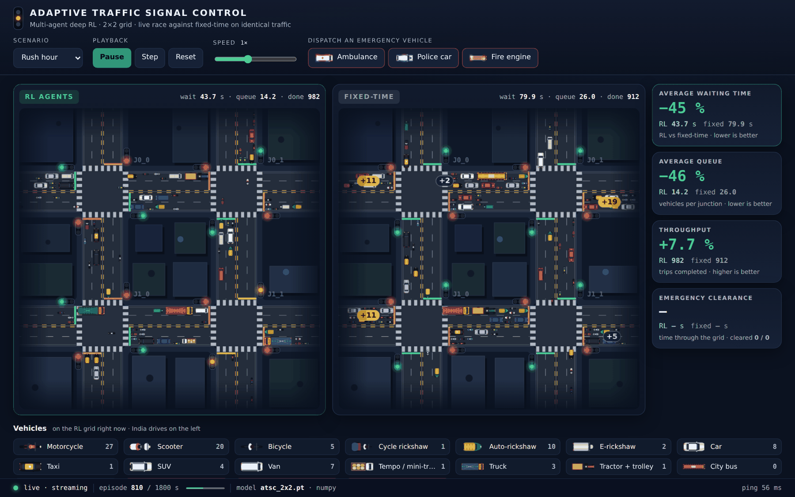
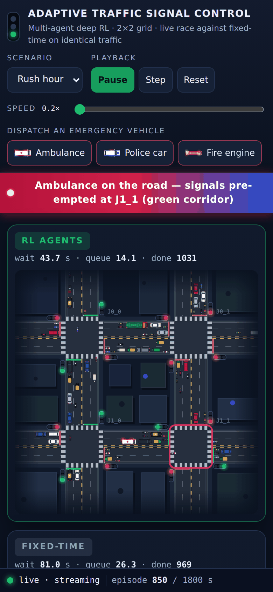
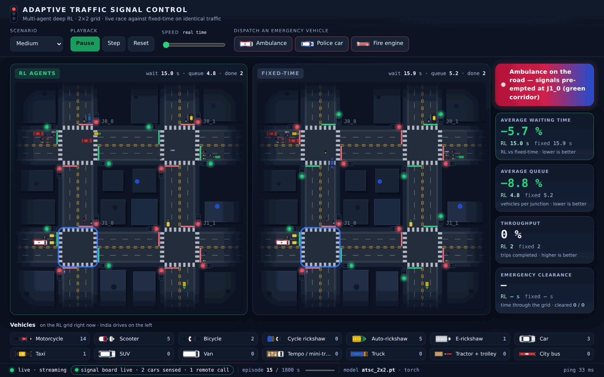

# Adaptive Traffic Signal Control with Deep Reinforcement Learning

<div align="center">

<!-- Render assigns the hostname on the first deploy. If yours differs, update the three
     links that point at it: the two badges here and the one in the Live demo section. -->

<a href="https://adaptive-traffic-signal-rl.onrender.com"></a>
&nbsp;
<a href="https://render.com/deploy?repo=https://github.com/Adityakumar1805/adaptive-traffic-signal-rl"></a>

<sub>Free instance: if it has been idle for a while the first request takes about a minute to wake it (returning visitors see a "Waking up the server…" screen). Everything after that is real time.</sub>


<p>
  
  
  
  
  
  
  
</p>

</div>

Four **Double + Dueling DQN** agents — one per junction of a 2 × 2 signalised grid — learn to
cut average waiting time by **15 % at light demand and 61 % at rush hour** against a fixed-time
controller. A safety finite-state machine makes conflicting greens impossible by construction,
and emergency preemption gets an ambulance through the grid up to **3.5× faster** (rush hour). It runs on
**SUMO** when SUMO is installed and on a **built-in point-queue simulator** when it isn't, and
ships a real-time dashboard that races the learned policy against the fixed-time baseline on
the same traffic, arrival for arrival — drawn as Indian traffic (two-wheelers, autos,
e-rickshaws, buses, tractors…) driving on the left, with ambulances, police cars and fire
engines you can dispatch yourself. The same agents can also switch the **16 traffic lights of
a table-top Arduino model**, in real time, with toy cars and a remote control feeding back
into the simulation ([the physical model](#the-physical-model)).

```bash
python run.py demo              # dashboard on http://127.0.0.1:8000 — nothing else to configure
python run.py demo --hardware   # ...and drive the Arduino signal model (docs/HARDWARE.md)
```

---

## 🚀 Live demo

### **<https://adaptive-traffic-signal-rl.onrender.com>**

No install, no SUMO, no checkpoint to train — the hosted instance runs the same shipped
model as the local demo. Three things worth doing in the first minute:

1. Set **Scenario** to **Rush hour** and watch the queues on the fixed-time grid (right)
   outgrow the road — the `+15` badges count the vehicles that no longer fit on screen —
   while the RL grid (left) keeps them short.
2. Under **Dispatch an emergency vehicle**, press **Ambulance**, **Police car** or **Fire
   engine**. The same vehicle enters *both* grids and both pre-empt their signals for it,
   exactly as in the benchmark; the difference you see is how long it is stuck in traffic
   before it reaches a stop line.
3. Drop the **Speed** to 0.2× and press **Pause** / **Step** around a phase change to see
   the 3 s amber and the 2 s all-red the safety layer inserts.

The bottom bar says **live · streaming** while the WebSocket is up.

It is a shared simulation, deliberately: whoever else has the page open sees the same
race and can press the same buttons. Deployment details, the free-tier caveats and how to
host your own copy are in **[docs/DEPLOYMENT.md](docs/DEPLOYMENT.md)**.

---

## Measured results


Three controllers × four demand levels × three seeds = **36 runs**, every row in
[`outputs/benchmark_results.csv`](outputs/benchmark_results.csv), aggregated in
[`outputs/benchmark_summary.md`](outputs/benchmark_summary.md). Measured on the built-in
point-queue simulator; the SUMO backend is implemented and unit-tested but was not used to
produce these numbers.

| Demand | Fixed-time | Max-pressure | **RL agents** | RL vs fixed-time |
|---|---:|---:|---:|---:|
| Low (arrival ×0.35) | 26.3 s | **19.2 s** | 22.3 s | −15.1 % |
| Medium (×0.60) | 34.3 s | **22.5 s** | 25.2 s | −26.5 % |
| High (×0.90) | 68.7 s | 35.6 s | **35.2 s** | −48.8 % |
| Rush (×1.00) | 113.0 s | 50.5 s | **43.9 s** | −61.2 % |

Averaged over the four demand levels the agents remove **38 %** of the waiting time. The gain
is smallest where there is least to win, and it is worth saying plainly that **max-pressure
beats the agents at low and medium demand** (19.2 s and 22.5 s against 22.3 s and 25.2 s).
The agents take the lead under congestion: they edge past max-pressure at high demand
(35.2 s against 35.6 s) and win clearly at rush hour — 43.9 s against 50.5 s, and 14.1 queued
vehicles per junction against 16.3. Against fixed-time at rush they also clear **7.6 % more
vehicles**.

Queue length falls in step with waiting time, −15.3 % to −61.3 %. Emergency clearance with
preemption is **1.3× faster at low demand and 3.5× faster at rush** (113.7 s → 32.7 s), the
case that actually matters for an ambulance.

<table>
<tr>
<td width="50%"></td>
<td width="50%"></td>
</tr>
</table>

`python run.py eval` reruns all 36 episodes and overwrites both the CSVs and these plots.
The random seeds are fixed, so a rerun reproduces the table above rather than something
near it.

---

## The dashboard

One browser tab, two networks, the same arrivals fed to both: the learned policy on the
left, the fixed-time controller on the right. The queues you can see are the whole argument.



| Control / panel | What it does |
|---|---|
| **Scenario** | Low / Medium / High / Rush hour — restarts the race with those arrival rates |
| **Pause · Step · Reset** | Freeze, advance exactly one 5 s decision, or restart the episode |
| **Speed** | 0.2× to 8× (1× = one 5 s decision per 200 ms tick, 25× real time); with the Arduino model attached, real time to 200× real time |
| **Dispatch an emergency vehicle** | Ambulance, police car or fire engine (configurable) into *both* grids; the banner names it and the junction it pre-empts, and tells you when it is through the RL grid but still stuck in fixed-time traffic |
| **KPI cards** | RL's change against fixed-time — waiting time, queue, throughput — with the same sign convention as the results table (−26.5 % = 26.5 % less), and the emergency clearance time (compared only over vehicles that have cleared both grids). On a laptop they sit beside the grids, so the whole race and the numbers fit on one screen |
| **Vehicles** | All 18 vehicle types, drawn to scale, with how many of each are on the RL grid right now |
| **Charts** | Waiting time and queue length over the episode, RL against fixed-time |


**What is drawn is exactly what is simulated.** Each vehicle has a kind from a configurable
Indian traffic mix (`traffic_mix` in `config.yaml`: about half two-wheelers, then cars,
autos and e-rickshaws, a few buses, trucks, tempos and tractors). Kinds are cosmetic — they
come from their own random stream, so changing the mix never changes the traffic or a
published number. The browser receives the moment every vehicle leaves a queue and enters
a link, and from those it reconstructs every queue, every vehicle on a link and every
vehicle crossing a junction for any instant between two frames; a test checks that this
reconstruction equals the simulator's real state second by second. Vehicles keep to the
left, slow vehicles to the kerb lane, two-wheelers pair up in a lane, and emergency
vehicles flash.

<details>
<summary><b>How the page talks to the server</b></summary>

* One WebSocket, `/ws`. The server sends a `hello` (geometry, vehicle catalogue,
  scenarios) and then one frame per 200 ms tick: a *keyframe* (full state) every 10 s or
  after a reset, otherwise a *delta* with only what changed — about 0.7 KB at the default
  medium 1× (rush 8×: 4 KB), against 8–11 KB of full state per tick before.
* A heartbeat every 2 s while paused, a ping every 15 s, a 7 s watchdog, and reconnection
  with exponential back-off (0.5 s → 15 s, with jitter). A viewer that falls 25 frames
  behind is resynchronised with a keyframe instead of being sent a growing backlog.
* If WebSockets are blocked on the visitor's network, the page falls back to polling
  `/api/state` once a second (**live · polling**) and keeps retrying the socket.
* A service worker caches the page so that a returning visitor sees **Waking up the
  server…** while a sleeping free instance boots, instead of a blank tab. It is network-first,
  so it never serves stale code while the server answers.
* Without FastAPI the project falls back to a zero-dependency standard-library server that
  serves the same page and polls.

</details>

<p align="center"></p>

---

## The physical model

An Arduino Uno turns the RL grid into a table-top model: **16 signal heads** (four junctions ×
four approaches) switched through six 74HC595 shift registers, **8 IR sensors** at junction
J0_0 that add the toy cars they see to both simulated grids, a **4-button 433 MHz remote**
that dispatches an ambulance, a police car or a fire engine (or pauses the race), an OLED with
live figures and a siren. In this mode the dashboard runs in **real time**, so the 3 s amber
and 2 s all-red last 3 s and 2 s on the model; if the PC stops talking, every head falls back
to flashing amber within 3 s, and the board reconnects by itself.

<table>
<tr>
<td width="62%"></td>
<td width="38%"></td>
</tr>
</table>

```bash
python run.py hwtest            # check a freshly built board: every lamp, sensor and button
python run.py demo --hardware   # the lamps follow the RL grid; --mirror fixed shows fixed-time
```

**[docs/HARDWARE.md](docs/HARDWARE.md)** is the complete build: parts list, the model's
layout, the wiring (with the table of which shift-register output drives which lamp), uploading
the firmware, calibration, a five-minute demonstration for the viva, and troubleshooting. The
firmware is in [`firmware/atsc_signal_node`](firmware/atsc_signal_node); it was run unchanged
on a simulated ATmega328P driven by the real dashboard before release
([`tools/virtual_board`](tools/virtual_board)). Hardware mode is opt-in and leaves training,
the benchmark and every published number untouched.

---

## Fixed-time vs the learned policy

Both panels of the dashboard receive the *same* arrivals from the same seed, so every
difference you see is the controller and nothing else.

| | Fixed-time baseline | RL agents |
|---|---|---|
| Decides by | a clock: 30 s of NS, then 30 s of EW, forever | a 23-number observation, re-read every 5 s |
| Sees | nothing | its own 4 queues and waits, its phase, green-so-far, 4 emergency flags, and its neighbours' pressures and phases |
| Coordinates | not at all | through those neighbour features — no central controller, no message passing |
| Reacts to a surge | on the next scheduled turn | on the next 5 s decision |
| Reacts to an ambulance | the shared pre-emption override, once the vehicle is at a stop line | the same override, plus four emergency flags in its observation and a reward for clearing it |
| Waiting time at rush | 113.0 s | **43.9 s** |
| Code | [`control/fixed_time.py`](src/atsc/control/fixed_time.py) | [`control/rl_controller.py`](src/atsc/control/rl_controller.py) + [`agents/net.py`](src/atsc/agents/net.py) |

What the two share is the part that must not be negotiable: **both** drive the same safety
FSM, so both pay the same 3 s amber and 2 s all-red, and neither can produce a conflicting
green. The agents are not allowed to win by cheating the interlocks. One honest caveat:
`max_green_s: 60` ends a long green, but the FSM also accepts a new request during the amber
and all-red, so a controller that keeps asking for the same phase can cancel the change and
keep a side street waiting longer (up to about 113 s in the benchmark runs) — see
[Known limitations](#known-limitations).

A third controller, **max-pressure**, is in the benchmark but not on the dashboard. It
beats the agents at low and medium demand; the results table above says so out loud.

---

## Technology stack

| Layer | Choice | Fallback if absent |
|---|---|---|
| Learning | PyTorch 2.2 (Double + Dueling DQN, prioritized replay) | a from-scratch NumPy dueling net with manual backprop |
| Simulation | SUMO 1.18+ through TraCI | a built-in point-queue simulator behind the same interface |
| Web server | FastAPI + `uvicorn[standard]`, WebSocket push of compact deltas | `http.server` from the standard library, polling |
| Frontend | hand-written HTML, CSS and `<canvas>` JavaScript in ES modules; all 18 vehicle sprites drawn in code | — (there is no framework and no CDN to lose) |
| Numerics | NumPy 1.26, pandas + matplotlib for the benchmark plots | — |
| Hardware (optional) | Arduino Uno firmware in C++, six 74HC595s, FC-51 IR sensors, 433 MHz remote, SSD1306 OLED; `pyserial` on the PC | the dashboard alone |
| Config | one `config.yaml`, read by every module | — |
| Tests | pytest, 195 tests (the original 26 + protocol, server, vehicle, page and hardware tests) and a Playwright browser check | — |
| Hosting | Render free plan, defined in [`render.yaml`](render.yaml) | the same [`Dockerfile`](Dockerfile) on Spaces / Fly / Railway |

Three of those fallbacks are load-bearing rather than decorative: the hosted site runs
**without torch**, on the NumPy network loading the same checkpoint, which is what keeps
it inside a 512 MB free instance.

---

## Quickstart

**Windows**

```bat
run.bat
```

**macOS / Linux**

```bash
./run.sh
```

The launcher creates a virtual environment, installs the pinned dependencies, loads the
shipped pre-trained checkpoint, starts the dashboard and opens
**http://127.0.0.1:8000**. SUMO is not required — the built-in simulator takes over
automatically and the launcher prints how to install SUMO if you want the microscopic view.

<details>
<summary><b>Manual and advanced usage</b></summary>

```bash
pip install -r requirements.txt

python run.py doctor         # environment and dependency check, prints what is missing
python run.py demo           # train-if-needed, then open the live dashboard
python run.py train --quick  # 8 episodes, a few CPU minutes -> models/pretrained/atsc_2x2_quick.pt
python run.py train --overwrite  # full 112-episode curriculum; REPLACES the shipped model
python run.py eval           # 36-run benchmark -> outputs/*.csv, summary and KPI plots
python run.py eval --backend sumo   # the same benchmark on SUMO -> outputs/sumo/
python run.py sim            # watch the trained policy in SUMO-GUI (needs SUMO)
pytest                       # the test suite
python tools/e2e_browser.py --local   # headless-browser check of the dashboard (needs playwright)
```

Every one of these reads `config.yaml`; the few flags above only choose *what* to run, and
any command accepts `--debug` to print a full traceback. A plain `train` refuses to
overwrite the shipped checkpoint (and the training log the README quotes) unless you pass
`--overwrite`.

</details>

---

## How it works


One loop, five stages, and a closed feedback path. `config.yaml` is the only source of
numbers. The simulator is either SUMO through TraCI or the built-in point-queue model behind
the identical interface. Every 5 s of simulated time each junction produces a 23-number
observation, its agent asks for a phase, the safety layer decides whether that request is
legal, and the lamp state it produces is what advances the simulation to the next decision.

### What one agent computes


23 numbers in, 2 Q-values out, **19,971 parameters** in total. The observation is 4 queue
lengths + 4 waiting times + a 2-way phase one-hot + green-time-so-far + 4 emergency flags +
4 neighbour pressures + 4 neighbour phases. Those last eight are what make the agents
coordinate: there is no central controller and no message passing, only each junction
seeing what its neighbours are holding. All four agents share one set of weights and one
prioritized replay buffer, so every junction's experience trains the same policy.

### Why conflicting greens are impossible


The agent never writes to the lamps. It writes a *request*, and the finite-state machine in
`src/atsc/envs/phases.py` decides what happens: a request arriving before minimum green is
ignored, a phase reaching maximum green is switched whether the agent asked or not, and
every change pays a mandatory 3 s amber plus 2 s all-red. Conflicting greens are unreachable
states rather than states we try to avoid — `tests/test_phases_safety.py` hammers the machine
with randomised requests over 18,000 steps and asserts the invariant holds every step.

Emergency preemption sits on top of the same gate: the corridor is forced, never faked, so
an ambulance still gets its amber and all-red before the cross street loses its green.

---

## What makes it more than a tutorial DQN

| Differentiator | How it is delivered |
|---|---|
| **Multi-agent, multi-intersection** | One Double + Dueling DQN per junction on a 2 × 2 grid (`grid_rows`/`grid_cols` scale it), each observing its neighbours, so green-waves emerge instead of being scripted |
| **Safety by construction** | The phase FSM owns the lamps; the policy only makes requests. Unit-tested over 18,000 randomised steps |
| **Emergency preemption** | Detected at the stop line, corridor forced through the same safety gate, clearance time measured as a KPI; ambulance, police car and fire engine on the dashboard |
| **Honest benchmarking** | Not just fixed-time: also **max-pressure**, a controller that is near-optimal for throughput — and it wins at low demand, which the results report says out loud |
| **Runs on any machine** | SUMO ↔ built-in simulator, PyTorch ↔ a from-scratch NumPy dueling network with a portable checkpoint format, FastAPI ↔ a stdlib HTTP server. Three fallbacks, one behaviour |
| **Reproducible** | One seed in `config.yaml`, fixed evaluation seeds, tracked CSVs. `run.py eval` regenerates the published numbers byte for byte from the shipped checkpoint (retraining does not — see [Known limitations](#known-limitations)) |

---

## Repository map

```
run.py · run.bat · run.sh        one entry point, two one-click launchers (pick Python 3.10-3.12)
config.yaml                      every number the project uses, in one place
requirements.txt · environment.yml · pytest.ini
asgi.py · render.yaml            hosted deployment: entrypoint + Render Blueprint
Dockerfile · Procfile · requirements-deploy.txt (every package pinned)
CHANGELOG.md                     what changed in each release

src/atsc/
  config.py · seeding.py · logging_utils.py    config loading, determinism, logs
  vehicles.py  vehicle catalogue: 18 Indian vehicle types, traffic mix, emergency types
  sim/         SUMO backend, built-in point-queue simulator, net generator, SUMO autodetect
  envs/        traffic_env.py (multi-agent env) · phases.py (safety FSM) · spaces.py (observations)
  agents/      dueling DQN, prioritized replay, Double-DQN learner, Torch and NumPy nets, QMIX
  control/     fixed-time · max-pressure · RL · emergency preemption
  train/       curriculum trainer and checkpointing
  eval/        the 36-run benchmark harness, metrics, plots
  dashboard/   session.py (the race + wire protocol) · server.py (FastAPI/WebSocket) ·
               stdlib_server.py (fallback) · runtime.py, assets.py (headers, static files,
               page templating shared by both servers) · static/ (index.html, styles.css,
               sw.js, js/: main, transport, model, renderer, sprites, charts, ui)
  hw/          the Arduino model: wire protocol, bridge, real-time playback (mirror.py),
               self-test (selftest.py) — imported only in hardware mode

firmware/atsc_signal_node/       Arduino sketch + atsc_core.h (logic unit-tested on the PC)

models/pretrained/atsc_2x2.pt    the shipped checkpoint: 313 KB, 112 training episodes
tests/                           195 tests: the original 26 (env, safety, reward, replay,
                                 controllers, benchmark maths) + protocol, server, vehicles, page,
                                 hardware (firmware logic, playback, sensors, simulated board)
tools/                           e2e_browser.py (Playwright check) · bench_server.py (tick/payload/load)
                                 · virtual_board/ (the firmware on a simulated Uno) · hardware_diagrams.py
outputs/                         the CSVs, summary and plots this README quotes — tracked on purpose
docs/assets/ · docs/screenshots/ the diagrams and stills above
```

---

## Explaining it in a viva

A map from the question to the file that answers it.

| Asked | Point to | One-line answer |
|---|---|---|
| Where is the RL *environment*? | `envs/traffic_env.py` | PettingZoo-style parallel multi-agent env; `step()` advances 5 s and returns one reward per junction |
| What is the *state*? | `envs/spaces.py` | 23 numbers: queues, waits, phase one-hot, green-so-far, emergency flags, and neighbour pressures and phases |
| What is the *action*? | `envs/phases.py` | the target green phase — a request, not a command |
| How is *safety* guaranteed? | `envs/phases.py` (`SignalFSM`) | min/max green + mandatory amber + all-red; conflicting greens are unreachable, verified over 18,000 randomised steps |
| What is the *reward*? | `envs/traffic_env.py` `_rewards()` | −delay − pressure − switch penalty + emergency bonus; exact maths in [REPORT.md](REPORT.md) §4.3 |
| Which *algorithm*? | `agents/double_dqn_agent.py`, `agents/net.py` | Double + Dueling DQN, prioritized replay, target network, Huber loss, gradient clipping |
| Why *multi-agent*? | `agents/multi_agent.py` | one policy per junction, shared weights, neighbour-aware — coordination without a central controller |
| How does it *coordinate*? | `envs/spaces.py` | the eight neighbour features; no message passing, no central agent |
| *Emergency* handling? | `control/emergency.py` | preemption forces the serving phase, still through the safety FSM |
| Your *baselines*? | `control/fixed_time.py`, `control/max_pressure.py` | an honest fixed 30 s split, and max-pressure — which beats the agents at low demand |
| How do you *prove* the improvement? | `eval/benchmark.py` | identical seeds, three replicates, per-scenario improvement table and plots |
| No *SUMO*? | `sim/mini_backend.py` | built-in point-queue simulator behind the same interface; the demo still runs |
| No *PyTorch*? | `agents/net.py` | from-scratch NumPy dueling network with manual backprop and a portable checkpoint format |
| The *hardware*? | `firmware/atsc_signal_node`, `hw/mirror.py` | the board shows the RL grid second by second in real time; sensors and the remote feed the simulation; it fails safe to flashing amber ([HARDWARE.md](docs/HARDWARE.md)) |

The long form — verified file inventory, known weaknesses, and 144 questions with answers —
is in [docs/VIVA_MASTER.md](docs/VIVA_MASTER.md).

---

## Configuration

Every module reads [`config.yaml`](config.yaml). Change values, not code.

```yaml
network:   { grid_rows: 2, grid_cols: 2, link_length_m: 200 }   # 3x3 works — retrain first
signal:    { decision_interval_s: 5, min_green_s: 10, max_green_s: 60, yellow_s: 3, all_red_s: 2 }
demand:    { base_arrival_vps: 0.10, arterial_boost: 2.2 }      # the E-W arterial carries 2.2x
rl:        { algo: double_dueling_dqn, neighbor_obs: true, share_parameters: true }
reward:    { w_wait: 1.0, w_pressure: 0.30, w_switch: 0.20, w_emergency: 5.0 }
emergency: { enabled: true, preemption: true, types: { ambulance, police, fire } }
traffic_mix: { bike: 30, scooter: 22, car: 15, auto: 10, ... }  # cosmetic: what is drawn
dashboard: { tick_ms: 200, speeds: [0.2, 0.5, 1, 2, 4, 8], max_clients: 100 }
qmix:      { enabled: false }        # stretch goal: centralised training, decentralised execution
hardware:  { enabled: false, port: auto, mirror: rl }   # the Arduino model; or run.py demo --hardware
seed: 42
```

The safety numbers are enforced by the environment, not learned and not negotiable: the
agent cannot ask for a 4 s green, and no configuration makes the amber optional. The
shipped checkpoint only fits the `rl` / `network` settings it was trained with; change
those and loading it stops with a message naming the mismatch and how to retrain.

---

## Troubleshooting

| Symptom | Fix |
|---|---|
| "Python not found" | Install Python 3.10–3.12 and tick *Add to PATH* |
| You only have Python 3.13+ | The pinned PyTorch 2.2.2 / NumPy 1.26.4 have no wheels for it; install 3.12 alongside (the launchers pick it up, or `PYTHON=python3.12 ./run.sh`) |
| `./run.sh: Permission denied` | `chmod +x run.sh` (or `bash run.sh`) |
| The dashboard did not open | Browse to <http://127.0.0.1:8000> manually |
| "No trained model" | `python run.py train --quick` — a few CPU minutes |
| Port 8000 is busy | Change `dashboard.port` in `config.yaml` |
| You want the SUMO view | Install SUMO 1.18+, set `SUMO_HOME`, then `python run.py doctor` |
| The live demo takes ~a minute to load | Expected: the free instance sleeps after 15 min idle. Returning visitors see "Waking up the server…" and the page connects by itself |
| The bottom bar says **live · polling** | WebSockets are blocked on your network (proxy, VPN, antivirus); the page polls instead and keeps retrying the socket |
| "RL checkpoint does not match config.yaml" | You changed an `rl` / `network` setting the shipped model depends on: change it back, or `python run.py train --quick` |
| Your own deploy fails building numpy | Set `PYTHON_VERSION=3.12.6` — `render.yaml` already does |
| Anything else | `python run.py doctor` prints exactly what is missing and what it fell back to |

---

## Deploy your own live copy

The dashboard is one long-lived Python process: FastAPI serves the page, a JSON API and a
WebSocket, and an `asyncio` task advances the race every 200 ms and pushes a compact frame
to every browser. That rules out GitHub Pages (it cannot execute Python) and serverless
functions (an invocation cannot hold a WebSocket open or keep the broadcaster alive between
requests). It wants a small always-on container.

**Render's free plan** is the fit: WebSockets work, no card is needed, and it redeploys
on every push to `main`. The service is defined in code, so there is nothing to fill in
by hand:

```yaml
# render.yaml
buildCommand: pip install -r requirements-deploy.txt
startCommand: uvicorn asgi:app --host 0.0.0.0 --port $PORT --ws-max-size 65536 --ws-ping-interval 20 --ws-ping-timeout 20
healthCheckPath: /healthz
autoDeploy: true
```

Render dashboard → **New +** → **Blueprint** → pick this repository → **Apply**. Two to
four minutes later the URL is live, and `git push` is the whole deploy process from then
on.

| File | What it is for |
|---|---|
| [`asgi.py`](asgi.py) | the entrypoint. `build_app()` is a factory, so the package has no module-level `app`; this exposes one without calling `uvicorn.run()` or opening a browser |
| [`requirements-deploy.txt`](requirements-deploy.txt) | the runtime set with **every package pinned**, transitive ones included (38, all binary wheels). **No torch**: the NumPy network loads the same checkpoint |
| [`render.yaml`](render.yaml) | the Render Blueprint, free plan, auto-deploy from `main`, Python pinned to 3.12.6, health check on `/healthz` |
| [`Dockerfile`](Dockerfile) | Hugging Face Spaces, Fly.io, Railway or `docker run`; non-root, `${PORT:-7860}`, `HEALTHCHECK` |
| [`Procfile`](Procfile) | one line, for platforms that look for it |

`requirements.txt` still installs the full development set. Measured on the deploy stack
(`pip install -r requirements-deploy.txt`, Python 3.12.6): about **76 MiB** resident at idle
and **101 MiB** with 100 viewers connected, against a 512 MiB free instance; about **1.5 %**
of one CPU core at idle and **17 %** with 100 viewers (the free instance has 0.1 CPU); one
tick costs about **2 ms** at the default medium 1× and **12–16 ms** at rush 8×, against a
200 ms budget. `GET /healthz` reports the live numbers (version, build, viewers, tick cost,
payload size, CPU, memory).

The full walkthrough — the platform comparison, the Hugging Face Spaces alternative, the
environment variables, the post-deploy checklist, the free-tier caveats and what to do if
the bottom bar does not say **live · streaming** — is in
**[docs/DEPLOYMENT.md](docs/DEPLOYMENT.md)**.

---

## Documentation

| File | What is in it |
|---|---|
| [REPORT.md](REPORT.md) | The methodology: MDP formulation, reward derivation, training protocol, full result tables |
| [EXPLAINER.md](EXPLAINER.md) | Plain-language walkthrough of every module and why it exists |
| [CHEATSHEET.md](CHEATSHEET.md) | The demo script and the numbers worth knowing by heart |
| [docs/HARDWARE.md](docs/HARDWARE.md) | Building the Arduino signal model: parts, layout, wiring tables, firmware, calibration, viva demo, troubleshooting |
| [docs/DEPLOYMENT.md](docs/DEPLOYMENT.md) | Hosting the live dashboard: platform choice, exact steps, verification checklist |
| [docs/VIVA_MASTER.md](docs/VIVA_MASTER.md) | File-by-file verification, honest weaknesses, 144 questions with answers |
| [CHANGELOG.md](CHANGELOG.md) | Every change in each release, file by file |

---

## Known limitations

Stated plainly, because a reviewer will find them anyway. The first three live in code
that this release deliberately leaves untouched — the safety FSM and the trained model —
because every published number depends on them; fixing them means retraining and
re-benchmarking.

* **The FSM accepts a new request during amber and all-red.** Conflicting greens still
  cannot happen (that invariant is tested), but a controller can cancel a phase change
  mid-clearance and return to the same phase. With the shipped policy about one change in
  five is cancelled this way, and the longest wait of a side street for its green reached
  about 113 s in the benchmark runs, although `max_green_s` is 60.
* **Greens after the first are one second longer than configured** (11–61 s instead of
  10–60 s): an off-by-one in `phases.py`.
* **Training treats the time limit as a true ending** (no bootstrapping on the last
  transition), and **retraining is not bit-reproducible across NumPy versions** — the same
  112-episode recipe gave a different model on NumPy 2.x than on the pinned 1.26. The
  published numbers come from the one shipped checkpoint and regenerate exactly from it.
* **Pre-emption reacts at the stop line**, not on approach: an emergency vehicle joins the
  back of a queue and is only served once it reaches the front. The same override runs on
  both grids, as in the benchmark.
* **The fixed-time baseline is close to saturation at rush hour** (its east–west green can
  move about 0.21 vehicles/s against 0.22 arriving), so the −61 % at rush says as much about
  the baseline as about RL; max-pressure is the fairer comparison and the table reports it.
* **The built-in simulator is a point-queue model**: no spill-back, no car-following, no
  lane changing. Lanes, turns and vehicle types on the dashboard are drawn from the
  simulated queues and links, not simulated individually.
* **Some observation features saturate**: the waiting-time inputs reach their 1.0 cap on a
  quarter to a third of busy approaches in heavy traffic.

---

## Licence

MIT — see [LICENSE](LICENSE).

Built by **Aditya Kumar**.


