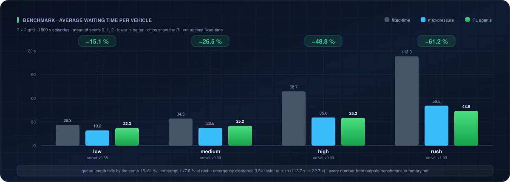
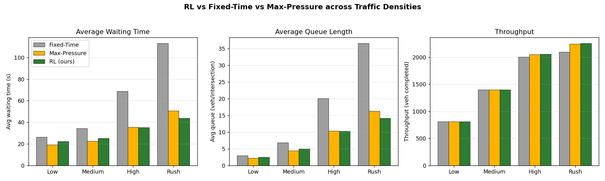
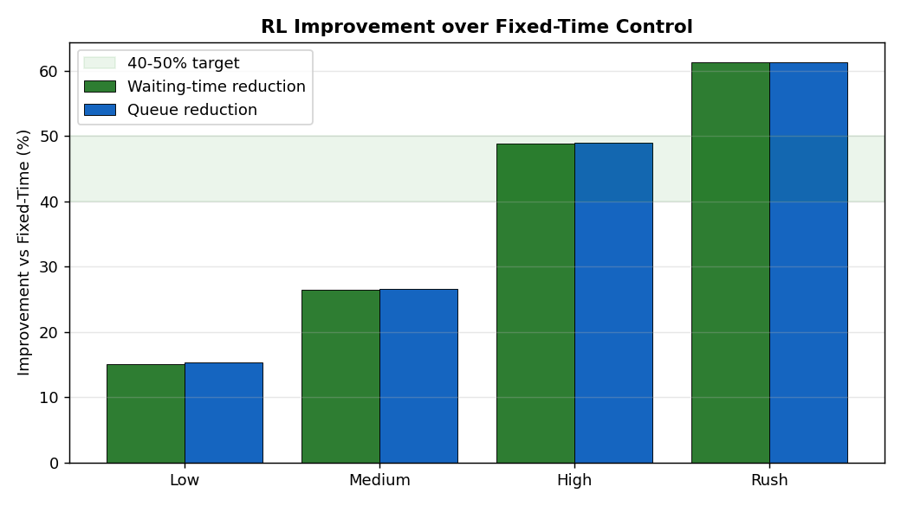
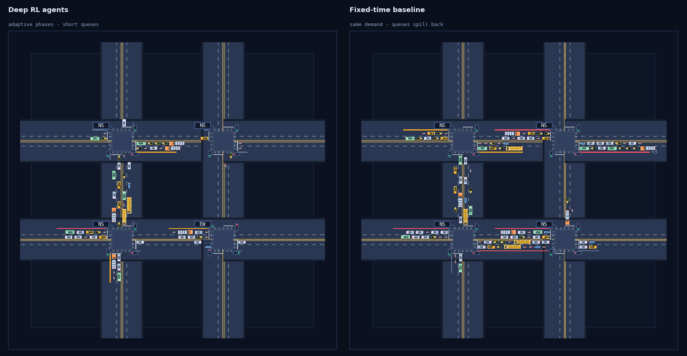
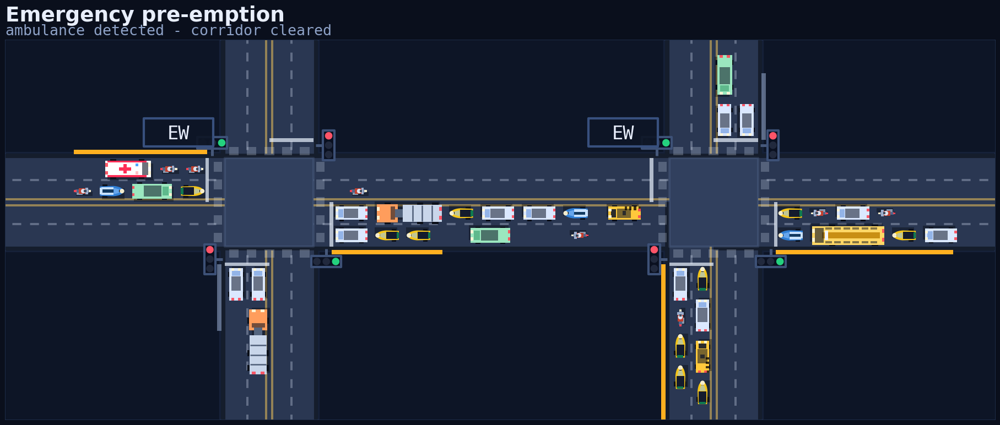

# Adaptive Traffic Signal Control with Deep Reinforcement Learning

<div align="center">

<!-- Render assigns the hostname on the first deploy. If yours differs, update the three
     links that point at it: the two badges here and the one in the Live demo section. -->

<a href="https://adaptive-traffic-signal-rl.onrender.com"></a>
&nbsp;
<a href="https://render.com/deploy?repo=https://github.com/Adityakumar1805/adaptive-traffic-signal-rl"></a>

<sub>Free instance: if it has been idle for a while the first request takes about 50 s to wake it. Everything after that is real time.</sub>



<p>
  
  
  
  
  
  
</p>

</div>

Four **Double + Dueling DQN** agents — one per junction of a 2 × 2 signalised grid — learn to
cut average waiting time by **15 % at light demand and 61 % at rush hour** against a fixed-time
controller. A safety finite-state machine makes conflicting greens impossible by construction,
and an approach-side ambulance detector clears an emergency corridor **3.5× faster**. It runs on
**SUMO** when SUMO is installed and on a **built-in point-queue simulator** when it isn't, and
ships a real-time dashboard that races the learned policy against the fixed-time baseline on
the same traffic, arrival for arrival.

```bash
python run.py demo          # dashboard on http://127.0.0.1:8000 — nothing else to configure
```

---

## 🚀 Live demo

### **<https://adaptive-traffic-signal-rl.onrender.com>**

No install, no SUMO, no checkpoint to train — the hosted instance runs the same shipped
model as the local demo. Three things worth doing in the first minute:

1. Set **Scenario** to **Rush** and watch the right-hand grid spill back along the
   arterial while the left-hand one keeps its queues short.
2. Press **Inject ambulance**. The RL side clears a corridor; the fixed-time side keeps
   running its 30-second split.
3. Drop the **Speed** to 1× and step through a phase change to see the amber and the
   all-red the safety layer inserts.

It is a shared simulation, deliberately: whoever else has the page open sees the same
race and can press the same buttons. Deployment details, the free-tier caveats and how to
host your own copy are in **[docs/DEPLOYMENT.md](docs/DEPLOYMENT.md)**.

---

## Measured results



Three controllers × four demand levels × three seeds = **36 runs**, every row in
[`outputs/benchmark_results.csv`](outputs/benchmark_results.csv), aggregated in
[`outputs/benchmark_summary.md`](outputs/benchmark_summary.md). Measured on the built-in
point-queue simulator; the SUMO backend is implemented and unit-tested but was not used to
produce these numbers.

| Demand | Fixed-time | Max-pressure | **RL agents** | RL vs fixed-time |
|---|---:|---:|---:|---:|
| Low (arrival ×0.35) | 26.3 s | **19.2 s** | 22.3 s | −15.1 % |
| Medium (×0.60) | 34.3 s | **22.5 s** | 25.2 s | −26.5 % |
| High (×0.90) | 68.7 s | 35.6 s | **35.2 s** | −48.8 % |
| Rush (×1.00) | 113.0 s | 50.5 s | **43.9 s** | −61.2 % |

Averaged over the four demand levels the agents remove **38 %** of the waiting time. The gain
is smallest where there is least to win, and it is worth saying plainly that **max-pressure
beats the agents at low and medium demand** (19.2 s and 22.5 s against 22.3 s and 25.2 s).
The agents take the lead under congestion: they edge past max-pressure at high demand
(35.2 s against 35.6 s) and win clearly at rush hour — 43.9 s against 50.5 s, and 14.1 queued
vehicles per junction against 16.3. Against fixed-time at rush they also clear **7.6 % more
vehicles**.

Queue length falls in step with waiting time, −15.3 % to −61.3 %. Emergency clearance with
preemption is **1.3× faster at low demand and 3.5× faster at rush** (113.7 s → 32.7 s), the
case that actually matters for an ambulance.

<table>
<tr>
<td width="50%"></td>
<td width="50%"></td>
</tr>
</table>

`python run.py eval` reruns all 36 episodes and overwrites both the CSVs and these plots.
The random seeds are fixed, so a rerun reproduces the table above rather than something
near it.

---

## The dashboard

One browser tab, two networks, the same arrivals fed to both: the learned policy on the
left, the fixed-time controller on the right. The queues you can see are the whole argument.



| Control | What it does |
|---|---|
| **Scenario** | Low / Medium / High / Rush — swaps the arrival rates live |
| **Play · Pause · Step** | Run freely, freeze, or advance exactly one 5 s decision |
| **Speed** | 1× to 8× |
| **Inject ambulance** | Spawns an emergency vehicle in *both* networks so you can watch preemption and the baseline's failure side by side |
| **KPI cards** | Live waiting-time and queue improvement, throughput, green-wave indicator |
| **Live charts** | Waiting time and queue length, RL against fixed-time, drawn on a native canvas |



The server is FastAPI + WebSocket when FastAPI is importable and a zero-dependency stdlib
polling server when it isn't — same HTML, same JavaScript, same four endpoints. The charts
are hand-drawn on `<canvas>` on purpose: no chart library, no CDN, no network access needed
after install.

---

## Fixed-time vs the learned policy

Both panels of the dashboard receive the *same* arrivals from the same seed, so every
difference you see is the controller and nothing else.

| | Fixed-time baseline | RL agents |
|---|---|---|
| Decides by | a clock: 30 s of NS, then 30 s of EW, forever | a 23-number observation, re-read every 5 s |
| Sees | nothing | its own 4 queues and waits, its phase, green-so-far, 4 emergency flags, and its neighbours' pressures and phases |
| Coordinates | not at all | through those neighbour features — no central controller, no message passing |
| Reacts to a surge | on the next scheduled turn | on the next 5 s decision |
| Reacts to an ambulance | not at all | the corridor is pre-empted on approach |
| Waiting time at rush | 113.0 s | **43.9 s** |
| Code | [`control/fixed_time.py`](src/atsc/control/fixed_time.py) | [`control/rl_controller.py`](src/atsc/control/rl_controller.py) + [`agents/net.py`](src/atsc/agents/net.py) |

What the two share is the part that must not be negotiable: **both** drive the same safety
FSM, so both pay the same 3 s amber and 2 s all-red, and neither can produce a conflicting
green. The agents are not allowed to win by cheating the interlocks — and because
`max_green_s: 60` is enforced against them too, they cannot starve a side street either.

A third controller, **max-pressure**, is in the benchmark but not on the dashboard. It
beats the agents at low and medium demand; the results table above says so out loud.

---

## Technology stack

| Layer | Choice | Fallback if absent |
|---|---|---|
| Learning | PyTorch 2.2 (Double + Dueling DQN, prioritized replay) | a from-scratch NumPy dueling net with manual backprop |
| Simulation | SUMO 1.18+ through TraCI | a built-in point-queue simulator behind the same interface |
| Web server | FastAPI + `uvicorn[standard]`, WebSocket push | `http.server` from the standard library, polling |
| Frontend | hand-written HTML, CSS and `<canvas>` JavaScript | — (there is no framework and no CDN to lose) |
| Numerics | NumPy 1.26, pandas + matplotlib for the benchmark plots | — |
| Config | one `config.yaml`, read by every module | — |
| Tests | pytest, 26 tests | — |
| Hosting | Render free plan, defined in [`render.yaml`](render.yaml) | the same [`Dockerfile`](Dockerfile) on Spaces / Fly / Railway |

Three of those fallbacks are load-bearing rather than decorative: the hosted site runs
**without torch**, on the NumPy network loading the same checkpoint, which is what keeps
it inside a 512 MB free instance.

---

## Quickstart

**Windows**

```bat
run.bat
```

**macOS / Linux**

```bash
./run.sh
```

The launcher creates a virtual environment, installs the pinned dependencies, loads the
shipped pre-trained checkpoint, starts the dashboard and opens
**http://127.0.0.1:8000**. SUMO is not required — the built-in simulator takes over
automatically and the launcher prints how to install SUMO if you want the microscopic view.

<details>
<summary><b>Manual and advanced usage</b></summary>

```bash
pip install -r requirements.txt

python run.py doctor         # environment and dependency check, prints what is missing
python run.py demo           # train-if-needed, then open the live dashboard
python run.py train --quick  # 8 episodes, a few CPU minutes
python run.py train          # full 112-episode curriculum -> models/pretrained/atsc_2x2.pt
python run.py eval           # 36-run benchmark -> outputs/*.csv and the KPI plots
python run.py sim            # watch the trained policy in SUMO-GUI (needs SUMO)
```

Every one of these reads `config.yaml` and nothing else. There are no command-line knobs
that silently override it.

</details>

---

## How it works



One loop, five stages, and a closed feedback path. `config.yaml` is the only source of
numbers. The simulator is either SUMO through TraCI or the built-in point-queue model behind
the identical interface. Every 5 s of simulated time each junction produces a 23-number
observation, its agent asks for a phase, the safety layer decides whether that request is
legal, and the lamp state it produces is what advances the simulation to the next decision.

### What one agent computes



23 numbers in, 2 Q-values out, **19,971 parameters** in total. The observation is 4 queue
lengths + 4 waiting times + a 2-way phase one-hot + green-time-so-far + 4 emergency flags +
4 neighbour pressures + 4 neighbour phases. Those last eight are what make the agents
coordinate: there is no central controller and no message passing, only each junction
seeing what its neighbours are holding. All four agents share one set of weights and one
prioritized replay buffer, so every junction's experience trains the same policy.

### Why conflicting greens are impossible



The agent never writes to the lamps. It writes a *request*, and the finite-state machine in
`src/atsc/envs/phases.py` decides what happens: a request arriving before minimum green is
ignored, a phase reaching maximum green is switched whether the agent asked or not, and
every change pays a mandatory 3 s amber plus 2 s all-red. Conflicting greens are unreachable
states rather than states we try to avoid — `tests/test_phases_safety.py` hammers the machine
with randomised requests over 18,000 steps and asserts the invariant holds every step.

Emergency preemption sits on top of the same gate: the corridor is forced, never faked, so
an ambulance still gets its amber and all-red before the cross street loses its green.

---

## What makes it more than a tutorial DQN

| Differentiator | How it is delivered |
|---|---|
| **Multi-agent, multi-intersection** | One Double + Dueling DQN per junction on a 2 × 2 grid (`grid_rows`/`grid_cols` scale it), each observing its neighbours, so green-waves emerge instead of being scripted |
| **Safety by construction** | The phase FSM owns the lamps; the policy only makes requests. Unit-tested over 18,000 randomised steps |
| **Emergency preemption** | Detected on approach, corridor forced through the same safety gate, clearance time measured as a KPI |
| **Honest benchmarking** | Not just fixed-time: also **max-pressure**, a controller that is near-optimal for throughput — and it wins at low demand, which the results report says out loud |
| **Runs on any machine** | SUMO ↔ built-in simulator, PyTorch ↔ a from-scratch NumPy dueling network with a portable checkpoint format, FastAPI ↔ a stdlib HTTP server. Three fallbacks, one behaviour |
| **Reproducible** | One seed in `config.yaml`, fixed evaluation seeds, tracked CSVs. The published numbers regenerate |

---

## Repository map

```
run.py · run.bat · run.sh        one entry point, two one-click launchers
config.yaml                      every number the project uses, in one place
requirements.txt · environment.yml · pytest.ini
asgi.py · render.yaml            hosted deployment: entrypoint + Render Blueprint
Dockerfile · Procfile · requirements-deploy.txt

src/atsc/
  config.py · seeding.py · logging_utils.py    config loading, determinism, logs
  sim/         SUMO backend, built-in point-queue simulator, net generator, SUMO autodetect
  envs/        traffic_env.py (multi-agent env) · phases.py (safety FSM) · spaces.py (observations)
  agents/      dueling DQN, prioritized replay, Double-DQN learner, Torch and NumPy nets, QMIX
  control/     fixed-time · max-pressure · RL · emergency preemption
  train/       curriculum trainer and checkpointing
  eval/        the 36-run benchmark harness, metrics, plots
  dashboard/   FastAPI + WebSocket server, stdlib fallback, static UI
  hw/          serial bridge for an LED signal board — Python side only, inert while disabled

models/pretrained/atsc_2x2.pt    the shipped checkpoint: 313 KB, 112 training episodes
tests/                           26 unit tests: env, safety, reward, replay, controllers, benchmark maths
outputs/                         the CSVs, summary and plots this README quotes — tracked on purpose
docs/assets/ · docs/screenshots/ the diagrams and stills above
```

---

## Explaining it in a viva

A map from the question to the file that answers it.

| Asked | Point to | One-line answer |
|---|---|---|
| Where is the RL *environment*? | `envs/traffic_env.py` | PettingZoo-style parallel multi-agent env; `step()` advances 5 s and returns one reward per junction |
| What is the *state*? | `envs/spaces.py` | 23 numbers: queues, waits, phase one-hot, green-so-far, emergency flags, and neighbour pressures and phases |
| What is the *action*? | `envs/phases.py` | the target green phase — a request, not a command |
| How is *safety* guaranteed? | `envs/phases.py` (`SignalFSM`) | min/max green + mandatory amber + all-red; conflicting greens are unreachable, verified over 18,000 randomised steps |
| What is the *reward*? | `envs/traffic_env.py` `_rewards()` | −delay − pressure − switch penalty + emergency bonus; exact maths in [REPORT.md](REPORT.md) §4.3 |
| Which *algorithm*? | `agents/double_dqn_agent.py`, `agents/net.py` | Double + Dueling DQN, prioritized replay, target network, Huber loss, gradient clipping |
| Why *multi-agent*? | `agents/multi_agent.py` | one policy per junction, shared weights, neighbour-aware — coordination without a central controller |
| How does it *coordinate*? | `envs/spaces.py` | the eight neighbour features; no message passing, no central agent |
| *Emergency* handling? | `control/emergency.py` | preemption forces the serving phase, still through the safety FSM |
| Your *baselines*? | `control/fixed_time.py`, `control/max_pressure.py` | an honest fixed 30 s split, and max-pressure — which beats the agents at low demand |
| How do you *prove* the improvement? | `eval/benchmark.py` | identical seeds, three replicates, per-scenario improvement table and plots |
| No *SUMO*? | `sim/mini_backend.py` | built-in point-queue simulator behind the same interface; the demo still runs |
| No *PyTorch*? | `agents/net.py` | from-scratch NumPy dueling network with manual backprop and a portable checkpoint format |

The long form — verified file inventory, known weaknesses, and 144 questions with answers —
is in [docs/VIVA_MASTER.md](docs/VIVA_MASTER.md).

---

## Configuration

Every module reads [`config.yaml`](config.yaml). Change values, not code.

```yaml
network:   { grid_rows: 2, grid_cols: 2, link_length_m: 200 }   # 3x3 works — retrain first
signal:    { decision_interval_s: 5, min_green_s: 10, max_green_s: 60, yellow_s: 3, all_red_s: 2 }
demand:    { base_arrival_vps: 0.10, arterial_boost: 2.2 }      # the E-W arterial carries 2.2x
rl:        { algo: double_dueling_dqn, neighbor_obs: true, share_parameters: true }
reward:    { w_wait: 1.0, w_pressure: 0.30, w_switch: 0.20, w_emergency: 5.0 }
emergency: { enabled: true, preemption: true }
qmix:      { enabled: false }        # stretch goal: centralised training, decentralised execution
hardware:  { enabled: false }        # no board is built yet; nothing in src/atsc/hw runs while false
seed: 42
```

The safety numbers are enforced by the environment, not learned and not negotiable: the
agent cannot ask for a 4 s green, and no configuration makes the amber optional.

---

## Troubleshooting

| Symptom | Fix |
|---|---|
| "Python not found" | Install Python 3.10–3.12 and tick *Add to PATH* |
| The dashboard did not open | Browse to <http://127.0.0.1:8000> manually |
| "No trained model" | `python run.py train --quick` — a few CPU minutes |
| Port 8000 is busy | Change `dashboard.port` in `config.yaml` |
| You want the SUMO view | Install SUMO 1.18+, set `SUMO_HOME`, then `python run.py doctor` |
| The live demo takes ~50 s to load | Expected: the free instance sleeps after 15 min idle. Reload once |
| Your own deploy fails building numpy | Set `PYTHON_VERSION=3.12.6` — `render.yaml` already does |
| Anything else | `python run.py doctor` prints exactly what is missing and what it fell back to |

---

## Deploy your own live copy

The dashboard is one long-lived Python process: FastAPI serves four endpoints and an
`asyncio` task pushes a snapshot to every browser every 200 ms. That rules out GitHub
Pages (it cannot execute Python) and rules out serverless functions (an invocation cannot
hold a WebSocket open or keep the broadcaster alive between requests). It wants a small
always-on container.

**Render's free plan** is the fit: WebSockets work, no card is needed, and it redeploys
on every push to `main`. The service is defined in code, so there is nothing to fill in
by hand:

```yaml
# render.yaml
startCommand: uvicorn asgi:app --host 0.0.0.0 --port $PORT
buildCommand: pip install -r requirements-deploy.txt
autoDeploy: true
```

Render dashboard → **New +** → **Blueprint** → pick this repository → **Apply**. Two to
four minutes later the URL is live, and `git push` is the whole deploy process from then
on.

| File | What it is for |
|---|---|
| [`asgi.py`](asgi.py) | the entrypoint. `build_app()` is a factory, so the package has no module-level `app`; this exposes one without calling `uvicorn.run()` or opening a browser |
| [`requirements-deploy.txt`](requirements-deploy.txt) | four runtime pins — numpy, PyYAML, fastapi, uvicorn. **No torch**: the NumPy network loads the same checkpoint |
| [`render.yaml`](render.yaml) | the Render Blueprint, free plan, auto-deploy from `main`, Python pinned to 3.12.6 |
| [`Dockerfile`](Dockerfile) | Hugging Face Spaces, Fly.io, Railway or `docker run`; non-root, `${PORT:-7860}` |
| [`Procfile`](Procfile) | one line, for platforms that look for it |

`requirements.txt` is untouched and still installs the full development set. Nothing in
the simulator, the agents, the safety FSM or the dashboard's JavaScript changed — the
deployed page is the local page. Measured on the deploy path: **41 MiB** peak RSS and
**4.7 ms** per broadcast tick at 8× speed against a 200 ms budget.

The full walkthrough — the platform comparison, the Hugging Face Spaces alternative, the
environment variables, a 16-point post-deploy checklist and the free-tier caveats — is in
**[docs/DEPLOYMENT.md](docs/DEPLOYMENT.md)**.

---

## Documentation

| File | What is in it |
|---|---|
| [REPORT.md](REPORT.md) | The methodology: MDP formulation, reward derivation, training protocol, full result tables |
| [EXPLAINER.md](EXPLAINER.md) | Plain-language walkthrough of every module and why it exists |
| [CHEATSHEET.md](CHEATSHEET.md) | The demo script and the numbers worth knowing by heart |
| [docs/DEPLOYMENT.md](docs/DEPLOYMENT.md) | Hosting the live dashboard: platform choice, exact steps, verification checklist |
| [docs/VIVA_MASTER.md](docs/VIVA_MASTER.md) | File-by-file verification, honest weaknesses, 144 questions with answers |

---

## Licence

MIT — see [LICENSE](LICENSE).

Built by **Aditya Kumar**.


