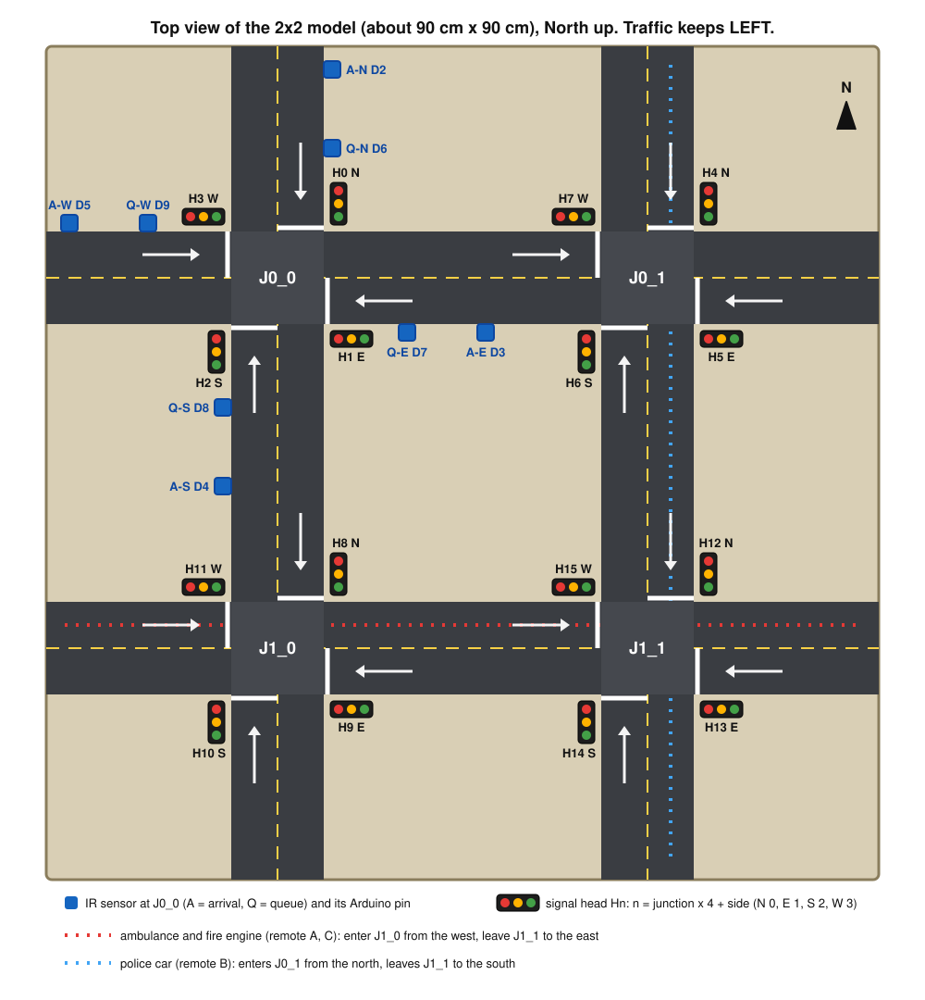
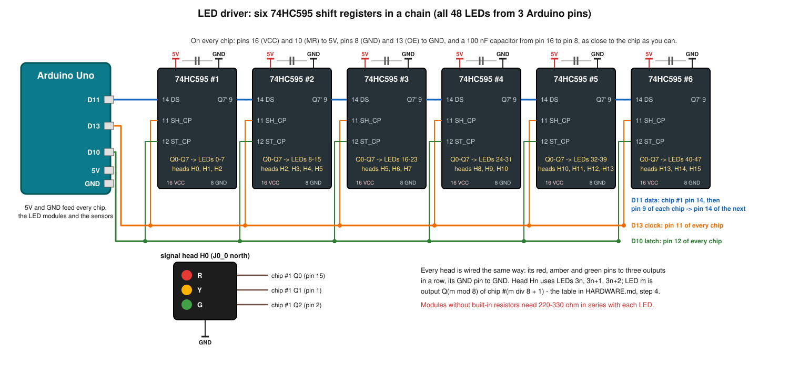
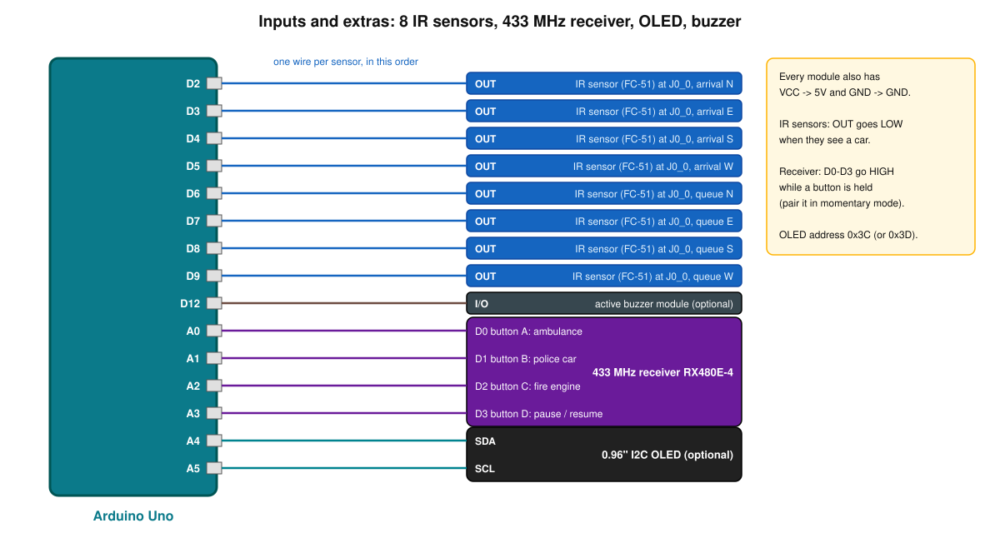
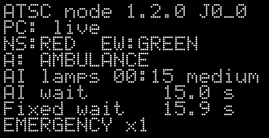

# The physical model: an Arduino-driven 2×2 signal grid

This guide takes you from a bag of parts to a table-top model whose **16 traffic lights are
switched by the trained RL agents**, live, while the dashboard shows the same junctions on
screen. Toy cars on the model are seen by IR sensors and join the simulation; a 433 MHz
remote dispatches an ambulance, a police car or a fire engine, and the AI clears a green
corridor for it on both the screen and the model.

Everything in the code is finished and tested. What only you can do is the soldering and
wiring — and every step below says how to check it before moving on.

```
 PC: python run.py demo --hardware                      Arduino Uno: firmware/atsc_signal_node
 ┌──────────────────────────────────────┐   USB serial   ┌─────────────────────────────────────┐
 │ simulation + 4 RL agents (as online) │                │ 6 × 74HC595 ─▶ 16 heads (48 LEDs)   │
 │ lamp states, second by second        │ ─────────────▶ │                                     │
 │                                      │   >L frames    │ 8 IR sensors at J0_0 (toy cars)     │
 │ toy cars join the simulated traffic  │ ◀───────────── │ 433 MHz receiver (4-button remote)  │
 │ the browser dashboard shows the race │   <D <Q <E <C  │ OLED (live figures), buzzer (siren) │
 └──────────────────────────────────────┘                └─────────────────────────────────────┘
```

**Contents** — 1 [How it works](#1-how-it-works-in-one-minute) ·
2 [Parts](#2-parts-list) · 3 [Software](#3-software-to-install) ·
4 [The base](#4-build-the-base) · 5 [Signal heads](#5-wire-the-16-signal-heads) ·
6 [Sensors and extras](#6-wire-the-sensors-remote-receiver-oled-and-buzzer) ·
7 [Upload](#7-upload-the-firmware) · 8 [First power-on](#8-first-power-on-check) ·
9 [Self-test](#9-run-the-self-test) · 10 [Calibrate](#10-calibrate-the-sensors-and-pair-the-remote) ·
11 [Live demo](#11-run-the-live-demo) · 12 [Viva script](#12-a-five-minute-demonstration-for-the-viva) ·
13 [Settings](#13-settings-reference) · 14 [How the software works](#14-how-the-software-works) ·
15 [Troubleshooting](#15-troubleshooting) · 16 [Budget build](#16-a-cheaper-one-junction-build) ·
17 [No board yet?](#17-trying-it-without-a-board)

---

## 1. How it works in one minute

* The PC runs exactly the dashboard you know: the trained RL agents against fixed-time, on
  identical traffic. With `--hardware` it also sends the **RL grid's lamp states** to the
  Arduino, one simulated second at a time, **played back in real time**: a 3 s amber lasts
  3 s on the model, a 2 s all-red lasts 2 s. (Without that, the dashboard's normal speed would
  flash the amber for 0.12 s.)
* The Arduino shifts those states into six chained **74HC595** shift registers — 48 outputs
  from 3 pins — which drive the 16 three-colour signal heads.
* At junction **J0_0** (top-left), eight **IR sensors** watch the four approaches: an
  *arrival* sensor counts each car that passes, a *queue* sensor notices a car waiting at the
  stop line. The PC adds those cars to **both** simulated grids, so the race stays fair, and
  the AI reacts to them.
* A 4-button **433 MHz remote**: A ambulance, B police car, C fire engine, D pause/resume.
* If the PC goes quiet for 3 s (program closed or crashed, USB data link lost), every head
  goes to **flashing amber** — what a real signal does when its controller fails — and the
  dashboard reconnects to the board by itself when it is back.

## 2. Parts list

For the full 2×2 model. Any Indian electronics store or marketplace has these; search for the
names in the first column. (§16 describes a cheaper one-junction build.)

| Part | Qty | Notes |
|---|---|---|
| Arduino Uno R3 (CH340 clone is fine) + USB cable | 1 | An **Arduino Nano** works too, with the same pin numbers |
| 74HC595 shift register, DIP-16 | 6 (+1 spare) | 16-pin IC sockets recommended |
| 100 nF (0.1 µF, code "104") ceramic capacitor | 6 | one per 74HC595 |
| Traffic-light LED module, 5 V, R/Y/G + GND pins | 16 | most have resistors on board (see §5) |
| — *or* 5 mm LEDs red / yellow / green + 220 Ω resistors | 16 each + 48 | if you build the heads yourself |
| IR obstacle sensor module **FC-51** (or TCRT5000 module) | 8 | 3 pins: VCC, GND, OUT |
| 433 MHz receiver **RX480E-4** + 4-button learning remote | 1 set | "4 channel learning code" kit |
| 0.96" OLED 128×64, **I2C** (SSD1306), 4 pins | 1 | optional; 1.3" SH1106 also works |
| Active buzzer module, 5 V (3 pins: VCC, GND, I/O) | 1 | optional |
| Breadboards (830 points) | 2–3 | or a perfboard once it works |
| Jumper wires M-M and M-F, ribbon/multi-core cable | lots | each head needs 4 wires (R, Y, G, GND) |
| Base: 90×90 cm foam board / sunboard / MDF (60×60 cm also works) | 1 | plus black chart paper, white and yellow tape or paint |
| Toy cars (die-cast, light colours) | 4–8 | dark cars reflect IR poorly — see §10 |
| 5 V 2 A adapter + DC jack | 1 | optional, only if you add more LEDs than this guide |
| 7.5–9 V DC adapter for the Uno's barrel jack | 1 | optional: keeps the board powered when the USB cable is pulled (§12, step 6) |

**Tools:** soldering iron (or a solderless breadboard build), multimeter, wire stripper, hot
glue gun, small screwdriver (sensor potentiometers).

**Power budget:** with one lamp lit per head (16 LEDs), 8 IR modules, the receiver, OLED and
buzzer, the model draws about 0.3–0.4 A — within the 0.5 A a USB port gives the Uno. If you
add more, power the LEDs and sensors from a separate 5 V supply and connect **only its GND**
to the Arduino's GND, never its 5 V to the Arduino's 5 V pin while USB is plugged in.

## 3. Software to install

1. **Arduino IDE 2** from arduino.cc (free). No extra libraries are needed — the firmware has
   its own small OLED driver and uses only the built-in `Wire` library.
2. **USB driver** for CH340 clones: recent Windows and macOS usually recognise them by
   themselves. If no port appears in *Tools → Port* when the board is plugged in, install the
   CH340 driver from the chip maker (WCH).
3. **pyserial** in the project's Python environment (the one you run `python run.py demo`
   from):
   ```bash
   pip install pyserial==3.5        # or: pip install -r requirements.txt
   python run.py doctor             # shows "pyserial OK" and the board's port once plugged in
   ```

## 4. Build the base



* Draw the four roads 10 cm wide (two 5 cm lanes), junction centres 40 cm apart, with a
  dashed yellow centre line and a white **stop line** across each lane that enters a junction.
* **Traffic keeps left**, as in India and on the dashboard. A car coming *from the north*
  drives south in the east half of the road, and so on — the arrows in the figure.
* Junction names follow the code: **J0_0** top-left, **J0_1** top-right, **J1_0** bottom-left,
  **J1_1** bottom-right (J*row*_*column*).
* Each approach gets its own signal head **on the left kerb of its lane, at the stop line**,
  facing the oncoming cars. Head numbers: **Hn, n = junction × 4 + side**, with sides
  N = 0, E = 1, S = 2, W = 3 — so J0_0 has H0 (N) H1 (E) H2 (S) H3 (W), J0_1 has H4–H7, J1_0
  H8–H11, J1_1 H12–H15. Label them on the board; you will need the numbers in §5.
* The eight **IR sensors** go at **J0_0**, on the same kerb as the heads: a **queue sensor
  (Q)** just behind each stop line, where the first waiting car stands, and an **arrival
  sensor (A)** about 15 cm further back. Glue them about 1 cm above the road, looking across
  their own lane only.
* Drill a hole beside every head and sensor and run its wires underneath to the electronics.
  Keep the Arduino and breadboards near J0_0, under or beside the board.
* The emergency vehicles drive the corridors the simulation uses: ambulance and fire engine
  **eastbound through J1_0 → J1_1**, police car **southbound through J0_1 → J1_1**. Mark them
  if you like — that is where the green wave will be visible.

## 5. Wire the 16 signal heads



**The chain** (do this first, test it with one head, then add the rest):

| Arduino | 74HC595 #1 | Every chip | Between chips |
|---|---|---|---|
| D11 (data) | pin 14 (DS) | pin 16 (VCC) → 5V, pin 10 (MR) → 5V | pin 9 (Q7′) of chip #k → pin 14 (DS) of chip #k+1 |
| D13 (clock) | pin 11 (SH_CP) | pin 8 (GND) → GND, pin 13 (OE) → GND | pin 11 of all six chips joined to D13 |
| D10 (latch) | pin 12 (ST_CP) | 100 nF from pin 16 to pin 8, close to the chip | pin 12 of all six chips joined to D10 |

Pin 1 of a 74HC595 is left of the notch when the notch points up; pins 1–8 run down the left
side, 9–16 up the right side. The eight outputs are **Q0 = pin 15** and **Q1–Q7 = pins 1–7**.

**Each head:** R, Y and G to three outputs (below), GND to GND. Traffic-light modules usually
carry their own resistors — look for three tiny black SMD parts marked e.g. "221" or "331" on
the module. Bare LEDs need a **220–330 Ω resistor in series with each LED**. Never connect an
LED straight to a 74HC595 output.

**Which output drives which lamp** — LED number m = head × 3 + colour (red 0, amber 1,
green 2), and LED m is output Q(m mod 8) of chip #(m div 8 + 1):

| chip | Q0 (pin 15) | Q1 (pin 1) | Q2 (pin 2) | Q3 (pin 3) | Q4 (pin 4) | Q5 (pin 5) | Q6 (pin 6) | Q7 (pin 7) |
|---|---|---|---|---|---|---|---|---|
| #1 | H0 red | H0 amber | H0 green | H1 red | H1 amber | H1 green | H2 red | H2 amber |
| #2 | H2 green | H3 red | H3 amber | H3 green | H4 red | H4 amber | H4 green | H5 red |
| #3 | H5 amber | H5 green | H6 red | H6 amber | H6 green | H7 red | H7 amber | H7 green |
| #4 | H8 red | H8 amber | H8 green | H9 red | H9 amber | H9 green | H10 red | H10 amber |
| #5 | H10 green | H11 red | H11 amber | H11 green | H12 red | H12 amber | H12 green | H13 red |
| #6 | H13 amber | H13 green | H14 red | H14 amber | H14 green | H15 red | H15 amber | H15 green |

The same table head by head (junction, approach and the phase group whose aspect it shows):

| head | junction | approach | shows | red | amber | green |
|---|---|---|---|---|---|---|
| H0 | J0_0 | N | NS | #1 Q0 (15) | #1 Q1 (1) | #1 Q2 (2) |
| H1 | J0_0 | E | EW | #1 Q3 (3) | #1 Q4 (4) | #1 Q5 (5) |
| H2 | J0_0 | S | NS | #1 Q6 (6) | #1 Q7 (7) | #2 Q0 (15) |
| H3 | J0_0 | W | EW | #2 Q1 (1) | #2 Q2 (2) | #2 Q3 (3) |
| H4 | J0_1 | N | NS | #2 Q4 (4) | #2 Q5 (5) | #2 Q6 (6) |
| H5 | J0_1 | E | EW | #2 Q7 (7) | #3 Q0 (15) | #3 Q1 (1) |
| H6 | J0_1 | S | NS | #3 Q2 (2) | #3 Q3 (3) | #3 Q4 (4) |
| H7 | J0_1 | W | EW | #3 Q5 (5) | #3 Q6 (6) | #3 Q7 (7) |
| H8 | J1_0 | N | NS | #4 Q0 (15) | #4 Q1 (1) | #4 Q2 (2) |
| H9 | J1_0 | E | EW | #4 Q3 (3) | #4 Q4 (4) | #4 Q5 (5) |
| H10 | J1_0 | S | NS | #4 Q6 (6) | #4 Q7 (7) | #5 Q0 (15) |
| H11 | J1_0 | W | EW | #5 Q1 (1) | #5 Q2 (2) | #5 Q3 (3) |
| H12 | J1_1 | N | NS | #5 Q4 (4) | #5 Q5 (5) | #5 Q6 (6) |
| H13 | J1_1 | E | EW | #5 Q7 (7) | #6 Q0 (15) | #6 Q1 (1) |
| H14 | J1_1 | S | NS | #6 Q2 (2) | #6 Q3 (3) | #6 Q4 (4) |
| H15 | J1_1 | W | EW | #6 Q5 (5) | #6 Q6 (6) | #6 Q7 (7) |

(The figures in brackets are chip pin numbers.) At most three LEDs per chip are ever lit at
once — one per head — which keeps every chip well inside its current limit.

## 6. Wire the sensors, remote receiver, OLED and buzzer



| Device | Its pin | Arduino | Also |
|---|---|---|---|
| IR arrival sensors at J0_0: N, E, S, W | OUT | **D2, D3, D4, D5** | VCC → 5V, GND → GND |
| IR queue sensors at J0_0: N, E, S, W | OUT | **D6, D7, D8, D9** | VCC → 5V, GND → GND |
| Buzzer module | I/O (or +) | **D12** | VCC → 5V, GND → GND |
| 433 MHz receiver RX480E-4 | D0, D1, D2, D3 | **A0, A1, A2, A3** | VCC (+5V) → 5V, GND → GND; VT unused |
| OLED (I2C) | SDA, SCL | **A4, A5** | VCC → 5V, GND → GND (the 4-pin modules accept 5 V) |

D0/D1 of the Arduino stay free: they are the USB serial line to the PC. All grounds are joined.

## 7. Upload the firmware

1. Open **`firmware/atsc_signal_node/atsc_signal_node.ino`** in the Arduino IDE (the folder
   also holds `atsc_core.h`; keep the two together).
2. If your build differs, change the **SETTINGS** block at the top of the sketch (§13) — for
   example `ENABLE_RF 0` while the receiver is not wired yet.
3. *Tools → Board → Arduino AVR Boards → Arduino Uno* (Nano: *Arduino Nano*; for many clones
   *Processor: ATmega328P (Old Bootloader)*), *Tools → Port* → the board.
4. Press **Upload**. The IDE reports about:
   ```
   Sketch uses 9494 bytes (29%) of program storage space. Maximum is 32256 bytes.
   Global variables use 1188 bytes (58%) of dynamic memory, leaving 860 bytes for local variables.
   ```

## 8. First power-on check

Straight after the upload (and every time the board powers up or the port is opened):

1. **Lamp test** — every head red (½ s), amber (½ s), green (½ s), red, then dark. A head
   that stays dark, or shows the wrong colour in one of these steps, has a wiring fault
   (§15). The buzzer beeps once.
2. **Flashing amber** on every head: the board is waiting for the PC. That is correct.
3. The OLED shows `ATSC node 1.2.0 J0_0`, `PC: waiting...`.
4. Optional: *Tools → Serial Monitor* at **115200 baud** shows
   ```
   <I,atsc-node 1.2.0 J0_0 heads=16,C3
   <H,2731,E8
   <H,3731,FE
   ```
   one heartbeat a second. Wave a hand at a sensor and you see `<D,J0_0,N,E3`.
   **Close the Serial Monitor afterwards** — only one program can use the port at a time.

## 9. Run the self-test

```bash
python run.py hwtest                  # or: python run.py hwtest --port /dev/cu.usbserial-110
```

It finds the board, walks every head through green → amber → red, junction by junction, and
says on screen which heads should be lit; then it listens for 60 s while you pass a car (or
your hand) in front of each of the 8 sensors and press each remote button. The approach you
triggered turns green at J0_0 so the model answers back. A good run ends like this:

```
  Board answered: atsc-node 1.2.0 J0_0 heads=16
  Lamp walk - watch the model. All heads are RED except the ones named.
    J0_0: north + south heads GREEN
    J0_0: north + south heads AMBER
    ...
    NEW arrival sensor north (D2)   [1/12]
    NEW queue sensor north (D6) -> 3 waiting   [5/12]
    NEW remote: ambulance   [9/12]
    ...
  Summary
    sensors  : 8/8 seen
    remote   : 4/4 buttons seen
```

Fix anything it reports before going on — it is much easier now than in front of the panel.

## 10. Calibrate the sensors and pair the remote

**IR sensors.** Each FC-51 has a potentiometer and a small "obstacle" LED. With no car in
front, turn the screw until the LED is just off; put a car in its lane and check the LED comes
on, then move the car to the *other* lane and check it stays off. Light-coloured cars work
best; stick a strip of white tape on the side of dark ones. Sunlight and halogen lamps blind
IR sensors — keep the model out of direct sun.

**Remote.** The RX480E-4 has to learn your remote, in **momentary** mode (an output is HIGH
only while its button is held). On the usual RX480E-4: press its small learn button once —
its LED lights — then press any button on the remote; the LED blinks and the remote is
learned. Pressing learn twice or three times selects the toggle / latched modes, which this
project does not use; holding learn for several seconds (or pressing it 8 times, depending on
the version) forgets all remotes. Follow the leaflet that came with your kit if it differs.
Then run `python run.py hwtest` and press A, B, C, D: if they come out in a different order,
swap the receiver wires on A0–A3 (or just relabel the buttons).

## 11. Run the live demo

```bash
python run.py demo --hardware                              # finds the board by itself
python run.py demo --hardware --port COM5                  # Windows: name the port
python run.py demo --hardware --port /dev/cu.usbserial-110 # macOS
python run.py demo --hardware --mirror fixed               # the lamps show the fixed-time plan
python run.py demo --hardware --fast                       # start at the normal dashboard speed
```

The browser opens the usual dashboard, with two differences:

* the speed slider starts at **real time** (the other positions are 2×, 5×, 12.5×, 25×, 50×,
  100× and 200× real time — the lamps follow at every speed);
* the status bar shows the board: **signal board live · 3 cars sensed · 1 remote call**
  (amber: port open but the board silent; red: unplugged — it reconnects by itself).

The lamps show the **RL grid** — the left-hand one on screen — and trail the screen by a
second or two (the simulation decides 5 s at a time; the board plays each second for a
second). The OLED shows the board's own state on its top half and the PC's live figures on
the bottom half:



`Ctrl+C` stops the demo: the PC sends all-red and closes the port, which restarts the Uno
(lamp test), and the board then waits with flashing amber.

`hardware.enabled: true` in `config.yaml` does the same as `--hardware` for every `demo`.

## 12. A five-minute demonstration for the viva

1. **Start** `python run.py demo --hardware` before the examiners arrive; leave it at real
   time. Point out that the model and the left grid on screen are the same four junctions,
   controlled by four RL agents, and that the right grid is fixed-time on identical traffic.
2. **Safety:** watch a phase change on the model — 3 s amber, then 2 s all-red, then green.
   The RL agent only *requests* phases; the safety state machine (`src/atsc/envs/phases.py`)
   inserts amber and all-red and enforces the 10 s minimum green. The AI cannot skip it.
3. **A car on the model:** roll a toy car down the **north arm of J0_0** past the arrival
   sensor and stop it on the queue sensor at the red light. The status bar counts it, the
   dashboard shows the extra vehicles queued at J0_0 north, and within about 15 s the AI gives
   that approach green — in our simulations a car parked on the queue sensor got green after
   a median of 15 s, the earliest the 10 s minimum green and the 5 s clearance allow when the
   other direction has just turned green. Drive the car through on green.
4. **Emergency:** press **A** on the remote. The buzzer sounds, an ambulance appears on both
   grids heading east through J1_0 and J1_1, the junctions ahead of it turn green for the
   east-west corridor on the model, and the dashboard's clearance card later compares its
   time through the grid with the same ambulance under fixed-time. **B** sends a police car
   south through J0_1 and J1_1.
5. **Pause:** press **D** to freeze everything while you answer a question; **D** again
   resumes.
6. **Failure handling:** stop the program (`Ctrl+C`): the board is left without a controller
   and every head flashes amber, as a real signal does when its controller fails; start the
   demo again and the lamps follow the AI within a few seconds. If the Uno has its own
   7.5–9 V adapter on the barrel jack, you can pull the USB cable instead: flashing amber
   within 3 s, the dashboard keeps running, and when you plug the cable back in the board is
   live again in about 3 s. (On USB power alone, pulling the cable simply switches the board
   off.)
7. **Fixed-time on the model:** if there is time, restart with `--mirror fixed` and let them
   watch the fixed plan ignore the car on the queue sensor.

## 13. Settings reference

**Firmware** — the SETTINGS block at the top of `atsc_signal_node.ino`:

| Setting | Default | Meaning |
|---|---|---|
| `NODE_TLS` | `"J0_0"` | junction with the IR sensors (must exist on the dashboard) |
| `NUM_HEADS` | `16` | heads on the chain: 16 for the full model, 4 for one junction (§16) |
| `ENABLE_SENSORS`, `ENABLE_RF`, `ENABLE_OLED`, `ENABLE_BUZZER` | `1` | set 0 for parts not (yet) wired — an unconnected receiver input could otherwise read noise |
| `OLED_SH1106` | `0` | 1 for a 1.3" SH1106 display |
| `BUZZER_ACTIVE_LOW` | `0` | 1 for "low level trigger" buzzer modules |
| `IR_ACTIVE_LOW` | `1` | FC-51 / TCRT5000 modules pull OUT low when they see a car |
| `BEEP_ON_CAR` | `0` | 1 = chirp for every counted car |
| `QUEUE_LEVEL` | `3` | waiting vehicles a blocked queue sensor stands for |
| `LINK_TIMEOUT_MS` | `3000` | silence from the PC before flashing amber |

**PC** — the `hardware:` block of `config.yaml` (the command-line flags override it):

| Key | Default | Meaning |
|---|---|---|
| `enabled` | `false` | `true` = every `python run.py demo` drives the board (`--hardware` does it once) |
| `port` | `auto` | `auto`, `COM5`, `/dev/cu.usbserial-110`, `/dev/ttyUSB0`, or `loopback` (no board) |
| `mirror` | `rl` | grid the lamps show: `rl` or `fixed` (`--mirror`) |
| `realtime` | `true` | start at real time (`--fast` starts at the normal speed) |
| `lamps`, `detectors`, `rf_preemption` | `true` | switch each direction of the link off individually |
| `detect_cooldown_s` | `0.25` | ignore a second detection on the same approach within this time |
| `settle_s` | `2.0` | wait after opening the port (the Uno restarts when the port opens) |

## 14. How the software works

**Wire protocol** — short ASCII lines at 115200 baud, readable in the Serial Monitor, each
ending in a CRC-8 checksum so line noise can never switch a lamp:

| Direction | Line | Meaning |
|---|---|---|
| PC → board | `>L,GRARRAAG,CD` | lamps: two letters per junction (NS, EW) in the order J0_0 J0_1 J1_0 J1_1; R red, A amber, G green |
| PC → board | `>T,1,AI wait 23.4 s,55` | a line of text for the OLED (rows 0–3) |
| board → PC | `<D,J0_0,N,E3` | a car passed the north arrival sensor at J0_0 |
| board → PC | `<Q,J0_0,W,3,72` | a car is waiting on the west queue sensor (`0` = clear again) |
| board → PC | `<E,ew,ambulance,34` | remote button A (B: `ns,police`, C: `ew,fire`) |
| board → PC | `<C,toggle,ED` | remote button D: pause / resume |
| board → PC | `<H,12731,68` / `<I,atsc-node 1.2.0 J0_0 heads=16,C3` | heartbeat every second / identity at start-up |

Every lamp frame states all 16 heads, so a lost line is corrected by the next one; the PC
sends a frame on every change and at least once a second.

**Where the code is:**

| File | What it does |
|---|---|
| `firmware/atsc_signal_node/atsc_signal_node.ino` | the sketch: pins, shift registers, sensors, remote, buzzer, OLED, failsafe |
| `firmware/atsc_signal_node/atsc_core.h` | pure logic (checksum, parser, lamp mapping, debouncing, link watchdog), unit-tested on the PC |
| `src/atsc/hw/protocol.py` | the same protocol on the PC side |
| `src/atsc/hw/bridge.py` | sends only changes plus a 1 s heartbeat, filters what the board reports |
| `src/atsc/hw/mirror.py` | replays the simulation's per-second lamp states in real time; reconnects |
| `src/atsc/hw/selftest.py` | `python run.py hwtest` |
| `src/atsc/dashboard/session.py` | hardware mode: sensors → vehicles on both grids, remote → emergencies |
| `src/atsc/sim/mini_backend.py` `add_detected_arrival` | adds a sensed car without drawing a random number, so the simulated traffic is otherwise unchanged |

**Why real time needs a playback queue.** The dashboard simulates in bursts: each tick runs a
whole 5 s decision in milliseconds. The environment hands every simulated second's lamp state
to the hardware layer with its simulation time; a background thread plays them out one
simulated second per real second (or faster at higher speeds), so the model shows the same
sequence and the same durations the safety state machine produced.

**Why the published results are untouched.** The hardware code runs only in
`demo --hardware`; training and the benchmark never import it, and a sensed car is added
without consuming a random number, so even the simulated traffic around it is the traffic
the same seed always produces (`tests/test_hardware.py` checks both).

**How it was tested without a board.** `tests/test_hardware.py` (43 tests) checks the
protocol, compiles `atsc_core.h` on the PC and runs it against the Python side, and checks
the real-time playback with a fake clock. The compiled firmware was also run on a simulated
ATmega328P at 16 MHz (simavr, `tools/virtual_board/`), wired to a simulated shift-register
chain, OLED and sensors and driven by the real dashboard: every lamp change on the simulated
board matched the RL grid, amber lasted 3.0 s and all-red 2.0 s, all 8 sensors and 4 buttons
reached the simulation, and the board kept up with worst-case bursts of about 120 bytes at a
time. What a simulator cannot check is your wiring, your sensors' sensitivity and the
remote's pairing — that is what §8–§10 are for.

## 15. Troubleshooting

| Symptom | Likely cause | Fix |
|---|---|---|
| No port in the IDE / `hwtest` finds no board | USB driver or a charge-only cable | install the CH340 driver (§3), try another cable |
| Upload fails: "not in sync" / "programmer is not responding" | wrong board / processor, or something on D0/D1 | pick the right board; Nano clones: *ATmega328P (Old Bootloader)*; nothing may be wired to D0/D1 |
| "could not open serial port … busy / access denied" | the Serial Monitor (or another program) holds the port | close the Serial Monitor; Linux: `sudo usermod -aG dialout $USER`, log in again |
| Heads keep flashing amber while the demo runs | the PC is not reaching the board | check the status bar: red = wrong port or unplugged (use `--port`); amber = open but silent (firmware not uploaded?) |
| Random lamps for a moment at power-up | 74HC595s start with random contents | normal; the firmware clears them within milliseconds |
| A whole group of heads is wrong or shifted | the data chain (pin 9 → pin 14) or the chip order | follow the chain chip by chip; chip #1 is the one on D11 |
| One colour of one head wrong | that wire is on the wrong output | compare with the table in §5; `hwtest` walks every head |
| Flicker, lamps change at random | missing 100 nF capacitors, loose GND, long clock wire | add the capacitors, shorten D13's wire, join all grounds |
| Brown-out (board resets when many lamps light) | too much current from USB | power LEDs/sensors from a separate 5 V supply, common GND (§2) |
| A sensor never triggers / always triggers | potentiometer, dark car, sunlight | §10; `hwtest` shows each sensor live |
| Remote does nothing / fires on its own | not paired, wrong mode, or `ENABLE_RF 1` with no receiver | pair in momentary mode (§10); set `ENABLE_RF 0` until it is wired |
| OLED blank | address 0x3D, SH1106 display, or swapped SDA/SCL | the firmware tries 0x3C and 0x3D; set `OLED_SH1106 1` for 1.3" displays; A4 = SDA, A5 = SCL |
| Buzzer beeps all the time | low-level-trigger module | `BUZZER_ACTIVE_LOW 1` |
| Toy car added, but no green soon | the minimum green and clearance come first | expect up to ~15–20 s at real time; that is the safety state machine at work |

## 16. A cheaper one-junction build

Build only **J0_0**: 4 heads (12 LEDs) on **2** shift registers, the same sensors, remote,
OLED and buzzer. Set `NUM_HEADS 4` in the sketch. The PC still simulates all four junctions;
the other three appear only on screen.

## 17. Trying it without a board

* `python run.py demo --hardware --port loopback` runs the whole hardware path in memory —
  useful to see the real-time speed and the status bar before the parts arrive.
* On Linux, `tools/virtual_board/` runs the real compiled firmware on a simulated
  ATmega328P (simavr) with a simulated shift-register chain, OLED and sensors. See
  `tools/virtual_board/README.md`.
